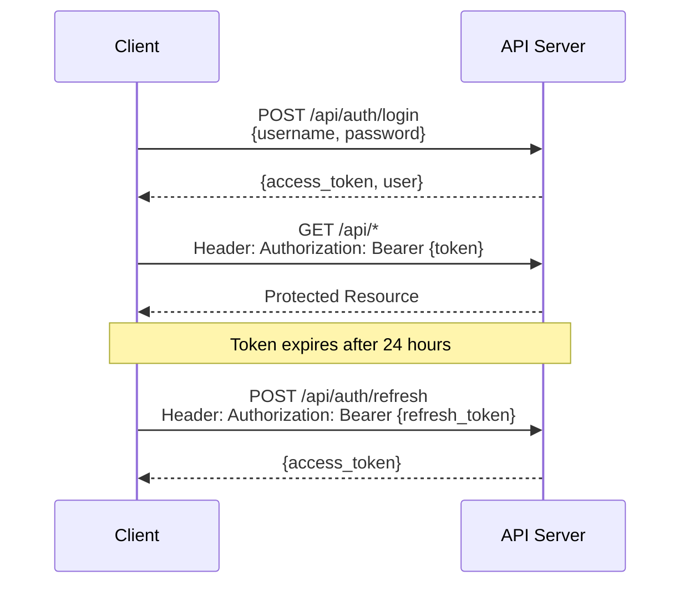
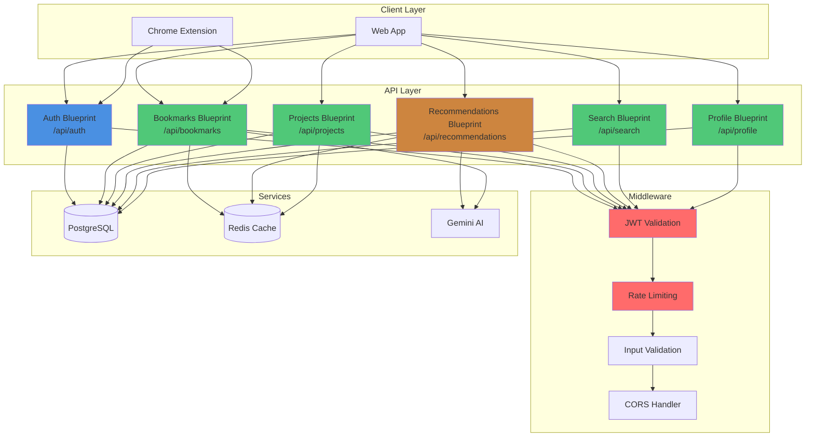

# API Architecture

Complete API documentation for Fuze - Intelligent Bookmark Manager.

## Table of Contents

1. [API Overview](#api-overview)
2. [Authentication](#authentication)
3. [API Endpoints](#api-endpoints)
4. [Request/Response Format](#requestresponse-format)
5. [Error Handling](#error-handling)
6. [Rate Limiting](#rate-limiting)

---

## API Overview

**Base URL**: `/api`

**Architecture**: Blueprint-based modular design

**Authentication**: JWT (JSON Web Tokens)

**Content Type**: `application/json`

**Status Codes**:
- `200` - Success
- `201` - Created
- `400` - Bad Request
- `401` - Unauthorized
- `403` - Forbidden
- `404` - Not Found
- `409` - Conflict
- `429` - Too Many Requests
- `500` - Internal Server Error
- `503` - Service Unavailable

---

## Authentication

### JWT Token Flow



**Token Storage**: 
- Access token: Client storage (localStorage/sessionStorage)
- Refresh token: HTTP-only cookie (secure)

**Token Validation**: All protected endpoints validate JWT on every request

---

## API Endpoints

### Authentication (`/api/auth`)

| Method | Endpoint | Auth | Description |
|--------|----------|------|-------------|
| `POST` | `/api/auth/register` | ❌ | Register new user |
| `POST` | `/api/auth/login` | ❌ | Login user |
| `POST` | `/api/auth/refresh` | ✅ | Refresh access token |
| `POST` | `/api/auth/logout` | ❌ | Logout user |
| `GET` | `/api/auth/verify` | ✅ | Verify token validity |
| `POST` | `/api/auth/verify-token` | ✅ | Verify token status |
| `POST` | `/api/auth/check-username` | ❌ | Check username availability |

**Register Request**:
```json
{
  "username": "johndoe",
  "email": "john@example.com",
  "password": "SecurePass123"
}
```

**Login Request**:
```json
{
  "username": "johndoe",
  "password": "SecurePass123"
}
```

**Login Response**:
```json
{
  "access_token": "eyJ0eXAiOiJKV1QiLCJhbGc...",
  "user": {
    "id": 1,
    "username": "johndoe",
    "email": "john@example.com"
  }
}
```

---

### Bookmarks (`/api/bookmarks`)

| Method | Endpoint | Auth | Description |
|--------|----------|------|-------------|
| `POST` | `/api/bookmarks` | ✅ | Save bookmark |
| `GET` | `/api/bookmarks` | ✅ | List bookmarks (paginated) |
| `DELETE` | `/api/bookmarks/<id>` | ✅ | Delete bookmark by ID |
| `DELETE` | `/api/bookmarks/url/<url>` | ✅ | Delete bookmark by URL |
| `DELETE` | `/api/bookmarks/all` | ✅ | Delete all bookmarks |
| `POST` | `/api/bookmarks/import` | ✅ | Bulk import bookmarks |
| `POST` | `/api/bookmarks/check-duplicate` | ✅ | Check if URL is duplicate |
| `GET` | `/api/bookmarks/import/progress` | ✅ | Get import progress |
| `GET` | `/api/bookmarks/analysis/progress` | ✅ | Get analysis progress |
| `POST` | `/api/bookmarks/extract-url` | ✅ | Extract content from URL |

**Save Bookmark Request**:
```json
{
  "url": "https://example.com/article",
  "title": "Article Title",
  "description": "Optional description",
  "category": "technology",
  "tags": ["python", "web"]
}
```

**List Bookmarks Query Params**:
- `page` (default: 1)
- `per_page` (default: 10)
- `search` (optional)
- `category` (optional)

**Bulk Import Request**:
```json
[
  {
    "url": "https://example.com/1",
    "title": "Article 1"
  },
  {
    "url": "https://example.com/2",
    "title": "Article 2"
  }
]
```

---

### Projects (`/api/projects`)

| Method | Endpoint | Auth | Description |
|--------|----------|------|-------------|
| `GET` | `/api/projects` | ✅ | List projects (paginated) |
| `POST` | `/api/projects` | ✅ | Create project |
| `GET` | `/api/projects/<id>` | ✅ | Get project by ID |
| `PUT` | `/api/projects/<id>` | ✅ | Update project |
| `DELETE` | `/api/projects/<id>` | ✅ | Delete project |
| `GET` | `/api/projects/<id>/tasks` | ✅ | Get project tasks |

**Create Project Request**:
```json
{
  "title": "My Project",
  "description": "Project description",
  "technologies": "React, Node.js, PostgreSQL"
}
```

**List Projects Query Params**:
- `page` (default: 1)
- `per_page` (default: 10)
- `include_tasks` (default: true)

---

### Recommendations (`/api/recommendations`)

| Method | Endpoint | Auth | Description |
|--------|----------|------|-------------|
| `POST` | `/api/recommendations/unified-orchestrator` | ✅ | **Primary** - Get recommendations |
| `POST` | `/api/recommendations/unified` | ✅ | Unified recommendations |
| `POST` | `/api/recommendations/unified-project/<id>` | ✅ | Project-based recommendations |
| `GET` | `/api/recommendations/project/<id>` | ✅ | Get project recommendations |
| `POST` | `/api/recommendations/task/<id>` | ✅ | Task-based recommendations |
| `POST` | `/api/recommendations/subtask/<id>` | ✅ | Subtask-based recommendations |
| `GET` | `/api/recommendations/status` | ❌ | Get engine status |
| `GET` | `/api/recommendations/performance-metrics` | ✅ | Get performance metrics |
| `POST` | `/api/recommendations/cache/clear` | ✅ | Clear recommendation cache |
| `GET` | `/api/recommendations/analysis/stats` | ✅ | Get analysis statistics |
| `GET` | `/api/recommendations/suggested-contexts` | ❌ | Get suggested contexts |
| `GET` | `/api/recommendations/recent-contexts` | ❌ | Get recent contexts |

**Unified Orchestrator Request**:
```json
{
  "user_input": "I want to learn React hooks",
  "context": "general",
  "limit": 10,
  "diversity": true
}
```

**Context Options**:
- `general` - General recommendations
- `project` - Project-specific recommendations
- `task` - Task-specific recommendations

**Response**:
```json
{
  "recommendations": [
    {
      "id": 123,
      "title": "React Hooks Guide",
      "url": "https://example.com/react-hooks",
      "relevance_score": 0.95,
      "reason": "Highly relevant to React hooks learning",
      "context_summary": "Comprehensive guide covering useState, useEffect..."
    }
  ],
  "total": 10,
  "engine_used": "unified_orchestrator",
  "cache_hit": false
}
```

---

### Search (`/api/search`)

| Method | Endpoint | Auth | Description |
|--------|----------|------|-------------|
| `POST` | `/api/search/semantic` | ✅ | Semantic search (vector similarity) |
| `GET` | `/api/search/text` | ✅ | Text search (keyword-based) |
| `POST` | `/api/search/supabase-semantic` | ✅ | Supabase semantic search |

**Semantic Search Request**:
```json
{
  "query": "machine learning tutorials",
  "limit": 10
}
```

**Text Search Query Params**:
- `q` - Search query (required)
- `limit` (default: 10)

---

### Profile (`/api/profile`)

| Method | Endpoint | Auth | Description |
|--------|----------|------|-------------|
| `GET` | `/api/profile` | ✅ | Get user profile |
| `PUT` | `/api/profile` | ✅ | Update profile |
| `PUT` | `/api/users/<id>` | ✅ | Update user (compatibility) |
| `PUT` | `/api/users/<id>/password` | ✅ | Change password |

**Update Profile Request**:
```json
{
  "username": "newusername",
  "technology_interests": "Python, React, AI"
}
```

**Change Password Request**:
```json
{
  "current_password": "OldPass123",
  "new_password": "NewPass123"
}
```

---

### Health Check

| Method | Endpoint | Auth | Description |
|--------|----------|------|-------------|
| `GET` | `/api/health` | ❌ | System health status |

**Response**:
```json
{
  "status": "healthy",
  "database": "connected",
  "redis": "connected",
  "timestamp": "2024-01-01T00:00:00Z"
}
```

---

## Request/Response Format

### Request Headers

**Required for Protected Endpoints**:
```
Authorization: Bearer {access_token}
Content-Type: application/json
```

**Optional**:
```
X-Request-ID: {unique_request_id}  # For request tracking
```

### Response Format

**Success Response**:
```json
{
  "message": "Operation successful",
  "data": { ... }
}
```

**Error Response**:
```json
{
  "message": "Error description",
  "error": "Detailed error message",
  "code": "ERROR_CODE"
}
```

### Pagination

**Paginated Response**:
```json
{
  "items": [...],
  "total": 100,
  "page": 1,
  "per_page": 10,
  "pages": 10
}
```

---

## Error Handling

### Error Codes

| Code | Description |
|------|-------------|
| `VALIDATION_ERROR` | Input validation failed |
| `AUTHENTICATION_ERROR` | Invalid or missing token |
| `AUTHORIZATION_ERROR` | Insufficient permissions |
| `NOT_FOUND` | Resource not found |
| `DUPLICATE_ERROR` | Duplicate resource |
| `RATE_LIMIT_ERROR` | Rate limit exceeded |
| `DATABASE_ERROR` | Database operation failed |
| `EXTERNAL_SERVICE_ERROR` | External service unavailable |

### Error Response Example

```json
{
  "message": "Invalid input",
  "error": "Username must be 3-50 characters",
  "code": "VALIDATION_ERROR",
  "field": "username"
}
```

---

## Rate Limiting

### Rate Limits

| Endpoint | Limit | Window |
|----------|-------|--------|
| `/api/auth/login` | 5 requests | 15 minutes (per IP) |
| `/api/auth/register` | 5 requests | 15 minutes (per IP) |
| `/api/recommendations/*` | 20 requests | 1 minute (per user) |
| All other endpoints | 100 requests | 1 minute (per user) |

### Rate Limit Headers

**Response Headers**:
```
X-RateLimit-Limit: 20
X-RateLimit-Remaining: 15
X-RateLimit-Reset: 1609459200
```

**Rate Limit Exceeded Response**:
```json
{
  "message": "Too many requests. Please try again later.",
  "retry_after": 60
}
```

**Status Code**: `429 Too Many Requests`

---

## API Architecture Diagram



---

## Best Practices

### 1. Authentication
- Always include `Authorization: Bearer {token}` header
- Refresh token before expiration
- Handle 401 errors gracefully (redirect to login)

### 2. Error Handling
- Check status codes before processing response
- Display user-friendly error messages
- Log errors for debugging

### 3. Rate Limiting
- Implement exponential backoff on 429 errors
- Cache responses when possible
- Batch requests when applicable

### 4. Performance
- Use pagination for large datasets
- Cache responses on client side
- Use semantic search for better results

### 5. Security
- Never expose tokens in URLs
- Use HTTPS in production
- Validate all user inputs

---

## Example Usage

### Complete Flow: Save Bookmark → Get Recommendations

```javascript
// 1. Login
const loginResponse = await fetch('/api/auth/login', {
  method: 'POST',
  headers: { 'Content-Type': 'application/json' },
  body: JSON.stringify({ username: 'user', password: 'pass' })
});
const { access_token } = await loginResponse.json();

// 2. Save Bookmark
const bookmarkResponse = await fetch('/api/bookmarks', {
  method: 'POST',
  headers: {
    'Content-Type': 'application/json',
    'Authorization': `Bearer ${access_token}`
  },
  body: JSON.stringify({
    url: 'https://example.com/article',
    title: 'Article Title'
  })
});

// 3. Get Recommendations
const recResponse = await fetch('/api/recommendations/unified-orchestrator', {
  method: 'POST',
  headers: {
    'Content-Type': 'application/json',
    'Authorization': `Bearer ${access_token}`
  },
  body: JSON.stringify({
    user_input: 'I want to learn React',
    context: 'general',
    limit: 10
  })
});
const recommendations = await recResponse.json();
```

---

*Last Updated: 2024*


