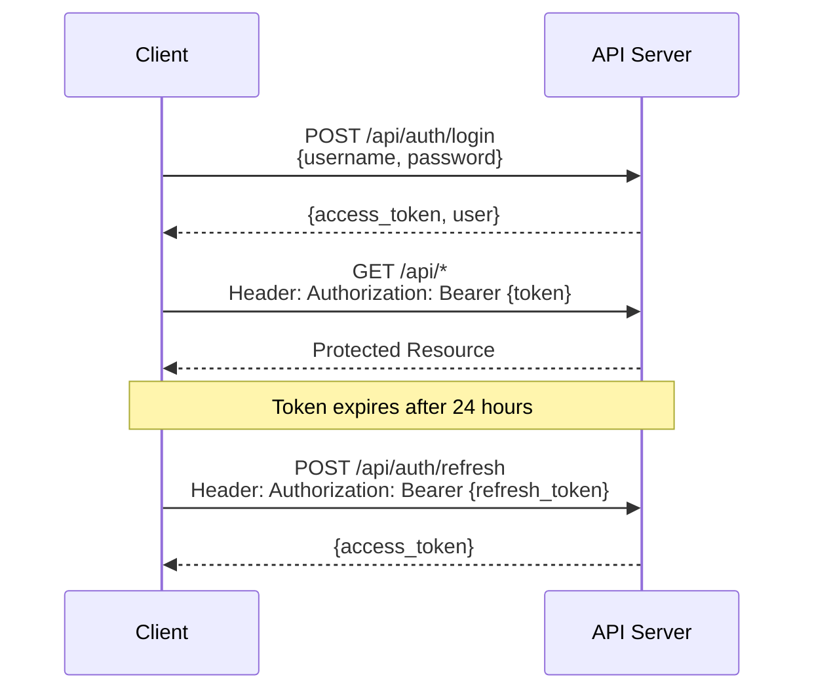

# API Architecture

Complete API documentation for Fuze - Intelligent Bookmark Manager.

## Table of Contents

1. [API Overview](#api-overview)
2. [Authentication](#authentication)
3. [API Endpoints](#api-endpoints)
4. [Request/Response Format](#requestresponse-format)
5. [Error Handling](#error-handling)
6. [Rate Limiting](#rate-limiting)

---

## API Overview

**Base URL**: `/api`

**Architecture**: Blueprint-based modular design

**Authentication**: JWT (JSON Web Tokens)

**Content Type**: `application/json`

**Status Codes**:
- `200` - Success
- `201` - Created
- `400` - Bad Request
- `401` - Unauthorized
- `403` - Forbidden
- `404` - Not Found
- `409` - Conflict
- `429` - Too Many Requests
- `500` - Internal Server Error
- `503` - Service Unavailable

---

## Authentication

### JWT Token Flow



**Token Storage**: 
- Access token: Client storage (localStorage/sessionStorage)
- Refresh token: HTTP-only cookie (secure)

**Token Validation**: All protected endpoints validate JWT on every request

---

## API Endpoints

### Authentication (`/api/auth`)

| Method | Endpoint | Auth | Description |
|--------|----------|------|-------------|
| `POST` | `/api/auth/register` | ❌ | Register new user |
| `POST` | `/api/auth/login` | ❌ | Login user |
| `POST` | `/api/auth/refresh` | ✅ | Refresh access token |
| `POST` | `/api/auth/logout` | ❌ | Logout user |
| `GET` | `/api/auth/verify` | ✅ | Verify token validity |
| `POST` | `/api/auth/verify-token` | ✅ | Verify token status |
| `POST` | `/api/auth/check-username` | ❌ | Check username availability |

**Register Request**:
```json
{
  "username": "johndoe",
  "email": "john@example.com",
  "password": "SecurePass123"
}
```

**Login Request**:
```json
{
  "username": "johndoe",
  "password": "SecurePass123"
}
```

**Login Response**:
```json
{
  "access_token": "eyJ0eXAiOiJKV1QiLCJhbGc...",
  "user": {
    "id": 1,
    "username": "johndoe",
    "email": "john@example.com"
  }
}
```

---

### Bookmarks (`/api/bookmarks`)

| Method | Endpoint | Auth | Description |
|--------|----------|------|-------------|
| `POST` | `/api/bookmarks` | ✅ | Save bookmark |
| `POST` | `/api/bookmarks/quick-save` | ✅ | Quick save bookmark (minimal fields) |
| `GET` | `/api/bookmarks` | ✅ | List bookmarks (paginated) |
| `DELETE` | `/api/bookmarks/<id>` | ✅ | Delete bookmark by ID |
| `DELETE` | `/api/bookmarks/url/<url>` | ✅ | Delete bookmark by URL |
| `DELETE` | `/api/bookmarks/all` | ✅ | Delete all bookmarks |
| `GET` | `/api/bookmarks/dashboard/stats` | ✅ | Get dashboard statistics |
| `POST` | `/api/bookmarks/import` | ✅ | Bulk import bookmarks |
| `POST` | `/api/bookmarks/check-duplicate` | ✅ | Check if URL is duplicate |
| `GET` | `/api/bookmarks/import/progress` | ✅ | Get import progress |
| `GET` | `/api/bookmarks/import/progress/stream` | ✅ | Stream import progress (SSE) |
| `GET` | `/api/bookmarks/analysis/progress` | ✅ | Get analysis progress |
| `GET` | `/api/bookmarks/analysis/progress/stream` | ✅ | Stream analysis progress (SSE) |
| `GET` | `/api/bookmarks/progress/stream` | ✅ | Stream general progress (SSE) |
| `POST` | `/api/bookmarks/extract-url` | ✅ | Extract content from URL |

**Save Bookmark Request**:
```json
{
  "url": "https://example.com/article",
  "title": "Article Title",
  "description": "Optional description",
  "category": "technology",
  "tags": ["python", "web"]
}
```

**List Bookmarks Query Params**:
- `page` (default: 1)
- `per_page` (default: 10)
- `search` (optional)
- `category` (optional)

**Bulk Import Request**:
```json
[
  {
    "url": "https://example.com/1",
    "title": "Article 1"
  },
  {
    "url": "https://example.com/2",
    "title": "Article 2"
  }
]
```

---

### Projects (`/api/projects`)

| Method | Endpoint | Auth | Description |
|--------|----------|------|-------------|
| `GET` | `/api/projects` | ✅ | List projects (paginated) |
| `POST` | `/api/projects` | ✅ | Create project |
| `GET` | `/api/projects/<id>` | ✅ | Get project by ID |
| `PUT` | `/api/projects/<id>` | ✅ | Update project |
| `DELETE` | `/api/projects/<id>` | ✅ | Delete project |
| `GET` | `/api/projects/<id>/tasks` | ✅ | Get project tasks |

**Create Project Request**:
```json
{
  "title": "My Project",
  "description": "Project description",
  "technologies": "React, Node.js, PostgreSQL"
}
```

**List Projects Query Params**:
- `page` (default: 1)
- `per_page` (default: 10)
- `include_tasks` (default: true)

---

### Recommendations (`/api/recommendations`)

| Method | Endpoint | Auth | Description |
|--------|----------|------|-------------|
| `POST` | `/api/recommendations/unified-orchestrator` | ✅ | **Primary** - Get unified orchestrator recommendations |
| `POST` | `/api/recommendations/generate-context` | ✅ | Generate recommendation context |
| `POST` | `/api/recommendations/unified` | ✅ | Unified recommendations |
| `POST` | `/api/recommendations/unified-project/<id>` | ✅ | Project-based unified recommendations |
| `GET` | `/api/recommendations/project/<id>` | ✅ | Get project recommendations |
| `POST` | `/api/recommendations/task/<id>` | ✅ | Task-based recommendations |
| `POST` | `/api/recommendations/subtask/<id>` | ✅ | Subtask-based recommendations |
| `POST` | `/api/recommendations/enhanced` | ✅ | Enhanced recommendations |
| `GET` | `/api/recommendations/status` | ✅ | Get engine status |
| `GET` | `/api/recommendations/phase-status` | ✅ | Get phase status |
| `POST` | `/api/recommendations/cache/clear` | ✅ | Clear recommendation cache |
| `POST` | `/api/recommendations/cache/clear-context` | ✅ | Clear context cache |
| `POST` | `/api/recommendations/cache/clear-all-recommendations` | ✅ | Clear all recommendation cache |
| `GET` | `/api/recommendations/analysis/stats` | ✅ | Get analysis statistics |
| `GET` | `/api/recommendations/analysis/analyze-content/<id>` | ✅ | Analyze specific content |
| `POST` | `/api/recommendations/analysis/start-background` | ✅ | Start background analysis |
| `POST` | `/api/recommendations/analysis/batch-analyze` | ✅ | Batch analyze content |
| `POST` | `/api/recommendations/feedback` | ✅ | Submit recommendation feedback |

**Unified Orchestrator Request**:
```json
{
  "user_input": "I want to learn React hooks",
  "context": "general",
  "limit": 10,
  "diversity": true
}
```

**Context Options**:
- `general` - General recommendations
- `project` - Project-specific recommendations
- `task` - Task-specific recommendations

**Response**:
```json
{
  "recommendations": [
    {
      "id": 123,
      "title": "React Hooks Guide",
      "url": "https://example.com/react-hooks",
      "relevance_score": 0.95,
      "reason": "Highly relevant to React hooks learning",
      "context_summary": "Comprehensive guide covering useState, useEffect..."
    }
  ],
  "total": 10,
  "engine_used": "unified_orchestrator",
  "cache_hit": false
}
```

---

### Search (`/api/search`)

| Method | Endpoint | Auth | Description |
|--------|----------|------|-------------|
| `POST` | `/api/search/semantic` | ✅ | Semantic search (vector similarity) |
| `GET` | `/api/search/text` | ✅ | Text search (keyword-based) |

**Semantic Search Request**:
```json
{
  "query": "machine learning tutorials",
  "limit": 10
}
```

**Text Search Query Params**:
- `q` - Search query (required)
- `limit` (default: 10)

---

### Profile (`/api/profile`)

| Method | Endpoint | Auth | Description |
|--------|----------|------|-------------|
| `GET` | `/api/profile` | ✅ | Get user profile |
| `PUT` | `/api/profile` | ✅ | Update profile |
| `PUT` | `/api/users/<id>` | ✅ | Update user (compatibility) |
| `PUT` | `/api/users/<id>/password` | ✅ | Change password |

### User API Key (`/api/user`)

| Method | Endpoint | Auth | Description |
|--------|----------|------|-------------|
| `POST` | `/api/user/api-key` | ✅ | Add/update user's API key |
| `GET` | `/api/user/api-key` | ✅ | Get user's API key info |
| `DELETE` | `/api/user/api-key` | ✅ | Delete user's API key |
| `GET` | `/api/user/api-key/status` | ✅ | Get API key status |
| `POST` | `/api/user/api-key/test` | ✅ | Test API key validity |
| `GET` | `/api/user/api-key/usage` | ✅ | Get API key usage statistics |

### Tasks (`/api/tasks`)

| Method | Endpoint | Auth | Description |
|--------|----------|------|-------------|
| `POST` | `/api/tasks` | ✅ | Create task |
| `GET` | `/api/tasks/project/<id>` | ✅ | Get project tasks |
| `POST` | `/api/tasks/ai-breakdown` | ✅ | AI-powered task breakdown |
| `PUT` | `/api/tasks/<id>` | ✅ | Update task |
| `DELETE` | `/api/tasks/<id>` | ✅ | Delete task |
| `POST` | `/api/tasks/<id>/subtasks` | ✅ | Create subtask |
| `GET` | `/api/tasks/<id>/subtasks` | ✅ | Get task subtasks |
| `PUT` | `/api/tasks/subtasks/<id>` | ✅ | Update subtask |
| `DELETE` | `/api/tasks/subtasks/<id>` | ✅ | Delete subtask |

### LinkedIn (`/api/linkedin`)

| Method | Endpoint | Auth | Description |
|--------|----------|------|-------------|
| `POST` | `/api/linkedin/extract` | ✅ | Extract LinkedIn post content |
| `POST` | `/api/linkedin/analyze` | ✅ | Analyze LinkedIn content |
| `POST` | `/api/linkedin/batch-extract` | ✅ | Batch extract LinkedIn posts |
| `GET` | `/api/linkedin/history` | ✅ | Get extraction history |
| `POST` | `/api/linkedin/save-to-bookmarks` | ✅ | Save LinkedIn content to bookmarks |
| `DELETE` | `/api/linkedin/extract/<id>` | ✅ | Delete extraction |
| `GET` | `/api/linkedin/status` | ✅ | Get LinkedIn service status |

### Feedback (`/api/feedback`)

| Method | Endpoint | Auth | Description |
|--------|----------|------|-------------|
| `POST` | `/api/feedback` | ✅ | Submit user feedback |

**Update Profile Request**:
```json
{
  "username": "newusername",
  "technology_interests": "Python, React, AI"
}
```

**Change Password Request**:
```json
{
  "current_password": "OldPass123",
  "new_password": "NewPass123"
}
```

---

### Health Check

| Method | Endpoint | Auth | Description |
|--------|----------|------|-------------|
| `GET` | `/api/health` | ❌ | System health status |

**Response**:
```json
{
  "status": "healthy",
  "database": "connected",
  "redis": "connected",
  "timestamp": "2024-01-01T00:00:00Z"
}
```

---

## Request/Response Format

### Request Headers

**Required for Protected Endpoints**:
```
Authorization: Bearer {access_token}
Content-Type: application/json
```

**Optional**:
```
X-Request-ID: {unique_request_id}  # For request tracking
```

### Response Format

**Success Response**:
```json
{
  "message": "Operation successful",
  "data": { ... }
}
```

**Error Response**:
```json
{
  "message": "Error description",
  "error": "Detailed error message",
  "code": "ERROR_CODE"
}
```

### Pagination

**Paginated Response**:
```json
{
  "items": [...],
  "total": 100,
  "page": 1,
  "per_page": 10,
  "pages": 10
}
```

---

## Error Handling

### Error Codes

| Code | Description |
|------|-------------|
| `VALIDATION_ERROR` | Input validation failed |
| `AUTHENTICATION_ERROR` | Invalid or missing token |
| `AUTHORIZATION_ERROR` | Insufficient permissions |
| `NOT_FOUND` | Resource not found |
| `DUPLICATE_ERROR` | Duplicate resource |
| `RATE_LIMIT_ERROR` | Rate limit exceeded |
| `DATABASE_ERROR` | Database operation failed |
| `EXTERNAL_SERVICE_ERROR` | External service unavailable |

### Error Response Example

```json
{
  "message": "Invalid input",
  "error": "Username must be 3-50 characters",
  "code": "VALIDATION_ERROR",
  "field": "username"
}
```

### Comprehensive Error Handling System

Fuze has a robust, user-friendly error handling system that provides consistent error display, proper logging, and actionable user feedback.

#### Error Categories

| Type | Description | User Message |
|------------|-------------|--------------|
| `NETWORK` | Connection issues | "Network connection failed. Please check your internet and try again." |
| `AUTH`  | Authentication problems | "Your session has expired. Please log in again." |
| `VALIDATION` | Input validation errors | "Please check your input and try again." |
| `SERVER`  | Server-side issues | "Server error occurred. Please try again later." |
| `RATE_LIMIT` | Rate limiting | "Too many requests. Please wait a moment before trying again." |
| `UNKNOWN`  | Unexpected errors | "An unexpected error occurred. Please try again." |

#### HTTP Status Code Mapping

- **400**: Validation Error
- **401/403**: Authentication Error
- **404**: Not Found (treated as generic error)
- **409**: Conflict (Validation Error)
- **422**: Unprocessable Entity (Validation Error)
- **429**: Too Many Requests (Rate Limit)
- **5xx**: Server Error

#### Frontend Error Handling

**Components:**
1. **API Error Handler** (`services/api.js`)
   - Central error processing and categorization
   - User-friendly message mapping
   - Retry logic with exponential backoff

2. **Error Handler Hook** (`hooks/useErrorHandler.js`)
   - React hook for consistent error handling in components
   - Automatic toast notifications
   - Context-aware error messages

3. **Error Display Component** (`components/ErrorDisplay.jsx`)
   - Reusable error UI component
   - Different variants (compact, full, card)
   - Visual error categorization

4. **Enhanced Toast System** (`contexts/ToastContext.jsx`)
   - Beautiful, animated notifications
   - Multiple notification types
   - Responsive design

#### Error Logging

- Detailed error information in development console
- Stack traces for debugging
- Context information for error identification
- Full traceback and context in error logs

---

## Rate Limiting

### Rate Limits (Flask-Limiter)

| Endpoint Pattern | Limit | Window | Scope |
|------------------|-------|--------|-------|
| `/api/auth/login` | 5 requests | 15 minutes | Per IP |
| `/api/auth/register` | 5 requests | 15 minutes | Per IP |
| `/api/recommendations/*` | 20 requests | 1 minute | Per User |
| All other endpoints | 100 requests | 1 minute | Per User |

**Note**: Rate limits use Redis backend for production, falls back to in-memory storage if Redis unavailable. Limits are configurable via environment variables.

### Rate Limit Headers

**Response Headers**:
```
X-RateLimit-Limit: 20
X-RateLimit-Remaining: 15
X-RateLimit-Reset: 1609459200
```

**Rate Limit Exceeded Response**:
```json
{
  "message": "Too many requests. Please try again later.",
  "retry_after": 60
}
```

**Status Code**: `429 Too Many Requests`

---

## API Architecture Diagram

```mermaid
graph TB
    subgraph Client["CLIENT LAYER"]
        direction LR
        Web["Web Application"]
        Ext["Chrome Extension"]
    end
    
    subgraph "API Layer"
        AuthBP[Auth Blueprint<br/>/api/auth]
        BookBP[Bookmarks Blueprint<br/>/api/bookmarks]
        ProjBP[Projects Blueprint<br/>/api/projects]
        RecBP[Recommendations Blueprint<br/>/api/recommendations]
        SearchBP[Search Blueprint<br/>/api/search]
        ProfBP[Profile Blueprint<br/>/api/profile]
        UserBP[User API Key Blueprint<br/>/api/user]
        TaskBP[Tasks Blueprint<br/>/api/tasks]
        LinkedBP[LinkedIn Blueprint<br/>/api/linkedin]
        FeedBP[Feedback Blueprint<br/>/api/feedback]
    end
    Web --> Row3
    Web --> Row4
    Web --> Row5
    Web --> Row6
    Ext --> Row1
    Ext --> Row4
    
    AuthBP --> JWT
    BookBP --> JWT
    ProjBP --> JWT
    RecBP --> JWT
    SearchBP --> JWT
    ProfBP --> JWT
    
    %% Middleware chain
    JWT --> RateLimit
    RateLimit --> Validation
    Validation --> CORS
    
    AuthBP --> JWT
    BookBP --> JWT
    ProjBP --> JWT
    RecBP --> JWT
    SearchBP --> JWT
    ProfBP --> JWT
    UserBP --> JWT
    TaskBP --> JWT
    LinkedBP --> JWT
    FeedBP --> JWT

    JWT --> RateLimit
    RateLimit --> Validation
    Validation --> CORS

    AuthBP --> DB
    BookBP --> DB
    ProjBP --> DB
    RecBP --> DB
    SearchBP --> DB
    ProfBP --> DB
    UserBP --> DB
    TaskBP --> DB
    LinkedBP --> DB
    FeedBP --> DB

    BookBP --> Redis
    RecBP --> Redis
    ProjBP --> Redis

    RecBP --> Gemini
    BookBP --> Gemini
    
    classDef clientStyle fill:#667eea,stroke:#5a67d8,stroke-width:3px,color:#fff,font-weight:bold
    classDef authStyle fill:#f093fb,stroke:#c471ed,stroke-width:2px,color:#fff,font-weight:bold
    classDef apiStyle fill:#4facfe,stroke:#00b4d8,stroke-width:2px,color:#fff,font-weight:bold
    classDef aiStyle fill:#fa709a,stroke:#f77089,stroke-width:2px,color:#fff,font-weight:bold
    classDef middlewareStyle fill:#ffa726,stroke:#fb8c00,stroke-width:2px,color:#fff,font-weight:bold
    classDef dbStyle fill:#43e97b,stroke:#38f9d7,stroke-width:3px,color:#fff,font-weight:bold
    
    class Web,Ext clientStyle
    class Row1 authStyle
    class Row2,Row3,Row4,Row5 apiStyle
    class Row6 aiStyle
    class JWT,RateLimit,CORS,Validation middlewareStyle
    class DB,Redis,Gemini dbStyle
```



---


---
Ujjwal Jain


