# System Architecture - Scalable Design

Complete scalable architecture documentation for Fuze - Intelligent Content Manager.

## ⚠️ Important: Current Implementation vs Scalable Design

**This document describes both:**
- **Current Implementation**: What's actually deployed and running (simpler, single-container setup)
- **Scalable Design**: Architecture that supports future scaling (ready for horizontal scaling)

**Key Distinction:**
- **Current**: 1 Gunicorn worker (gevent), single database, single Redis, RQ workers, no load balancer (platform handles routing)
- **Scalable**: Architecture designed to support multiple workers, load balancers, database replicas, Redis clusters when needed
- **Why**: Stateless design means scaling is just configuration changes, not code changes

## Table of Contents

1. [System Overview](#system-overview)
2. [Architecture Layers](#architecture-layers)
3. [Database Architecture](#database-architecture)
4. [Caching Architecture](#caching-architecture)
5. [Horizontal Scaling Strategy](#horizontal-scaling-strategy)
6. [Load Distribution](#load-distribution)
7. [Data Isolation & Security](#data-isolation--security)
8. [Background Processing Architecture](#background-processing-architecture)
9. [ML/AI Architecture](#mlai-architecture)
10. [API Architecture](#api-architecture)
11. [Frontend Architecture](#frontend-architecture)
12. [Deployment Architecture](#deployment-architecture)

---

## System Overview

Fuze is built as a scalable, multi-tenant system designed to handle thousands of concurrent users with individual API keys, isolated data, and independent processing pipelines.

### Core Principles

1. **User Isolation**: Complete data isolation per user
2. **Horizontal Scalability**: Stateless design for easy scaling
3. **Multi-Layer Caching**: Redis + In-memory caching
4. **Background Processing**: Non-blocking async operations
5. **Connection Pooling**: Efficient database connection management
6. **Rate Limiting**: Per-user and per-IP rate limits
7. **Graceful Degradation**: System works even when components fail

### High-Level Architecture

**Current Implementation (What's Deployed):**

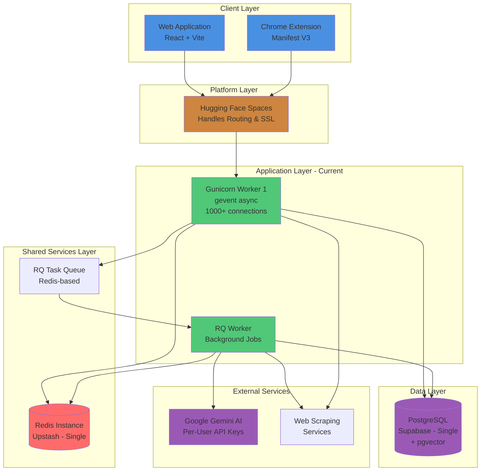
```mermaid
graph TB
    subgraph "Client Layer"
        WebApp[Web Application<br/>React + Vite]
        Extension[Chrome Extension<br/>Manifest V3]
    end
    
    subgraph "Platform Layer"
        Platform[Hugging Face Spaces<br/>Handles Routing & SSL]
    end
    
    subgraph "Application Layer - Current"
        Worker1[Gunicorn Worker 1<br/>gevent async<br/>1000+ connections]
        RQWorker[RQ Worker<br/>Background Jobs]
    end
    
    subgraph "Shared Services Layer"
        Redis[(Redis Instance<br/>Upstash - Single)]
        Queue[RQ Task Queue<br/>Redis-based]
    end
    
    subgraph "Data Layer"
        PostgreSQL[(PostgreSQL<br/>Supabase - Single<br/>+ pgvector)]
    end
    
    subgraph "External Services"
        Gemini[Google Gemini AI<br/>Per-User API Keys]
        WebContent[Web Scraping<br/>Services]
    end
    
    WebApp --> Platform
    Extension --> Platform
    
    Platform --> Worker1
    
    Worker1 --> Redis
    Worker1 --> PostgreSQL
    
    Worker1 --> Queue
    Queue --> RQWorker
    
    RQWorker --> Redis
    RQWorker --> PostgreSQL
    RQWorker --> Gemini
    RQWorker --> WebContent
    
    Worker1 --> WebContent
    
    style WebApp fill:#4a90e2
    style Extension fill:#4a90e2
    style Platform fill:#cd853f
    style Worker1 fill:#50c878
    style RQWorker fill:#50c878
    style Redis fill:#ff6b6b
    style PostgreSQL fill:#9b59b6
    style Gemini fill:#9b59b6
```

**Scalable Design (Future-Ready Architecture):**

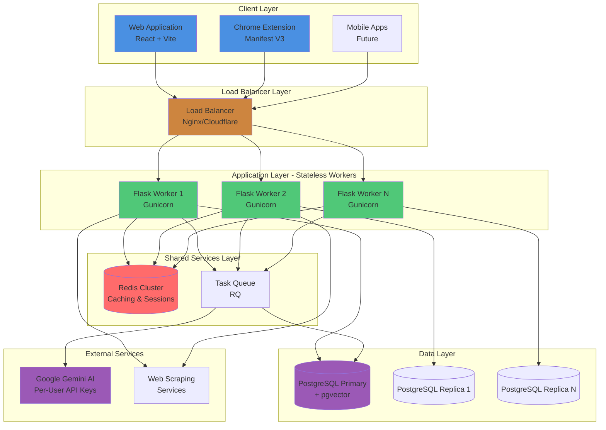
```mermaid
graph TB
    subgraph "Client Layer"
        WebApp[Web Application<br/>React + Vite]
        Extension[Chrome Extension<br/>Manifest V3]
        Mobile[Mobile Apps<br/>Future]
    end
    
    subgraph "Load Balancer Layer"
        LB[Load Balancer<br/>Nginx/Cloudflare]
    end
    
    subgraph "Application Layer - Stateless Workers"
        Worker1[Flask Worker 1<br/>Gunicorn]
        Worker2[Flask Worker 2<br/>Gunicorn]
        WorkerN[Flask Worker N<br/>Gunicorn]
    end
    
    subgraph "Shared Services Layer"
        Redis[(Redis Cluster<br/>Caching & Sessions)]
        Queue[Task Queue<br/>RQ]
    end
    
    subgraph "Data Layer"
        PostgreSQL[(PostgreSQL Primary<br/>+ pgvector)]
        Replica1[(PostgreSQL Replica 1)]
        ReplicaN[(PostgreSQL Replica N)]
    end
    
    subgraph "External Services"
        Gemini[Google Gemini AI<br/>Per-User API Keys]
        WebContent[Web Scraping<br/>Services]
    end
    
    WebApp --> LB
    Extension --> LB
    Mobile --> LB
    
    LB --> Worker1
    LB --> Worker2
    LB --> WorkerN
    
    Worker1 --> Redis
    Worker2 --> Redis
    WorkerN --> Redis
    
    Worker1 --> Queue
    Worker2 --> Queue
    WorkerN --> Queue
    
    Worker1 --> PostgreSQL
    Worker2 --> Replica1
    WorkerN --> ReplicaN
    
    Queue --> PostgreSQL
    Queue --> Gemini
    
    Worker1 --> WebContent
    Worker2 --> WebContent
    
    style WebApp fill:#4a90e2
    style Extension fill:#4a90e2
    style LB fill:#cd853f
    style Worker1 fill:#50c878
    style Worker2 fill:#50c878
    style WorkerN fill:#50c878
    style Redis fill:#ff6b6b
    style PostgreSQL fill:#9b59b6
    style Gemini fill:#9b59b6
```

---

## Architecture Layers

### Layer 1: Client Layer

**Components:**
- Web Application (React + Vite)
- Chrome Extension (Manifest V3)
- Future: Mobile Apps

**Characteristics:**
- Stateless clients
- JWT token-based authentication
- API calls to backend
- Client-side caching

### Layer 2: Load Balancer Layer

**Current Implementation:**
- ❌ **Not Implemented**: No custom load balancer
- ✅ **Platform Handled**: Hugging Face Spaces handles routing, SSL termination, and health checks
- ✅ **Design Ready**: Architecture supports load balancer when needed

**Scalable Design (Future):**
- **Responsibilities:**
  - Request routing
  - SSL termination
  - Rate limiting (first line)
  - Health checks
  - Session affinity (if needed)
- **Implementation:**
  - Nginx or Cloudflare
  - Round-robin or least-connections
  - Health check endpoints

### Layer 3: Application Layer (Stateless Workers)

**Current Implementation:**
- ✅ **1 Gunicorn Worker**: Single worker with gevent async I/O
- ✅ **Gevent Worker Class**: Handles 1000+ concurrent connections per worker
- ✅ **Stateless Design**: No local state, all state in Redis/DB
- ✅ **Connection Pooling**: 5 base, 10 overflow connections
- ✅ **RQ Worker**: Separate background worker for async jobs

**Current Configuration** (`start.sh`):
```bash
gunicorn app:app \
    --workers 1 \
    --worker-class gevent \
    --worker-connections 1000
```

**Scalable Design (Future):**
- **Multiple Flask workers** (Gunicorn)
- **Stateless design** - no local state
- **Shared Redis** for sessions/cache
- **Connection pooling** to database
- **Scaling:**
  - Add/remove workers dynamically
  - Auto-scaling based on load
  - Each worker handles any request

### Layer 4: Shared Services Layer

**Current Implementation:**
- ✅ **Single Redis Instance**: Upstash (free tier)
- ✅ **RQ Task Queue**: Redis-based task queue (not Celery)
- ✅ **Shared Across Workers**: All workers use same Redis

**Scalable Design (Future):**
- **Redis Cluster** (caching, sessions, rate limiting)
- **Task Queue** (RQ/Background workers - already using RQ)
- **Message Broker** (for async tasks)

### Layer 5: Data Layer

**Current Implementation:**
- ✅ **Single PostgreSQL**: Supabase (single database instance)
- ✅ **pgvector Extension**: For vector search
- ✅ **Connection Pooling**: 5 base, 10 overflow connections
- ✅ **24 Production Indexes**: Optimized for performance
- ❌ **No Read Replicas**: All operations to single database

**Scalable Design (Future):**
- **PostgreSQL Primary** (writes)
- **PostgreSQL Replicas** (reads)
- **pgvector extension** for vector search
- **Connection pooling**
- **Read/write splitting** (architecture supports it)

---

## Database Architecture

### Database Schema Design

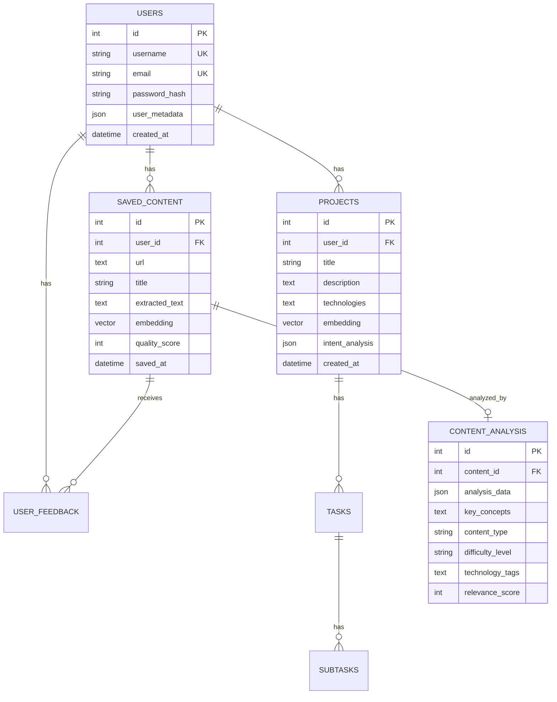
```mermaid
erDiagram
    USERS ||--o{ SAVED_CONTENT : has
    USERS ||--o{ PROJECTS : has
    USERS ||--o{ USER_FEEDBACK : has
    PROJECTS ||--o{ TASKS : has
    TASKS ||--o{ SUBTASKS : has
    SAVED_CONTENT ||--o| CONTENT_ANALYSIS : analyzed_by
    SAVED_CONTENT ||--o{ USER_FEEDBACK : receives
    
    USERS {
        int id PK
        string username UK
        string email UK
        string password_hash
        json user_metadata
        datetime created_at
    }
    
    SAVED_CONTENT {
        int id PK
        int user_id FK
        text url
        string title
        text extracted_text
        vector embedding
        int quality_score
        datetime saved_at
    }
    
    PROJECTS {
        int id PK
        int user_id FK
        string title
        text description
        text technologies
        vector embedding
        json intent_analysis
        datetime created_at
    }
    
    CONTENT_ANALYSIS {
        int id PK
        int content_id FK
        json analysis_data
        text key_concepts
        string content_type
        string difficulty_level
        text technology_tags
        int relevance_score
    }
```

### Database Indexing Strategy

**Critical Indexes for Performance:**

```sql
-- User Isolation Indexes (CRITICAL for security and performance)
CREATE INDEX idx_saved_content_user_id ON saved_content(user_id);
CREATE INDEX idx_saved_content_user_quality ON saved_content(user_id, quality_score DESC);
CREATE INDEX idx_saved_content_user_saved_at ON saved_content(user_id, saved_at DESC);

-- Vector Search Indexes (pgvector)
CREATE INDEX idx_saved_content_embedding ON saved_content 
USING ivfflat (embedding vector_cosine_ops) WITH (lists = 100);

CREATE INDEX idx_projects_embedding ON projects 
USING ivfflat (embedding vector_cosine_ops) WITH (lists = 100);

-- Composite Indexes for Common Queries
CREATE INDEX idx_projects_user_created ON projects(user_id, created_at DESC);
CREATE INDEX idx_tasks_project_created ON tasks(project_id, created_at DESC);

-- Case-Insensitive Lookups
CREATE INDEX idx_users_username_lower ON users(LOWER(username));
CREATE INDEX idx_users_email_lower ON users(LOWER(email));
```

**Index Strategy:**
- **User Isolation First**: All queries filtered by `user_id` - indexes ensure fast lookups
- **Composite Indexes**: Cover common query patterns (user_id + sort column)
- **Vector Indexes**: IVFFlat indexes for fast similarity search
- **Partial Indexes**: Conditional indexes for filtered queries

### Connection Pooling Architecture

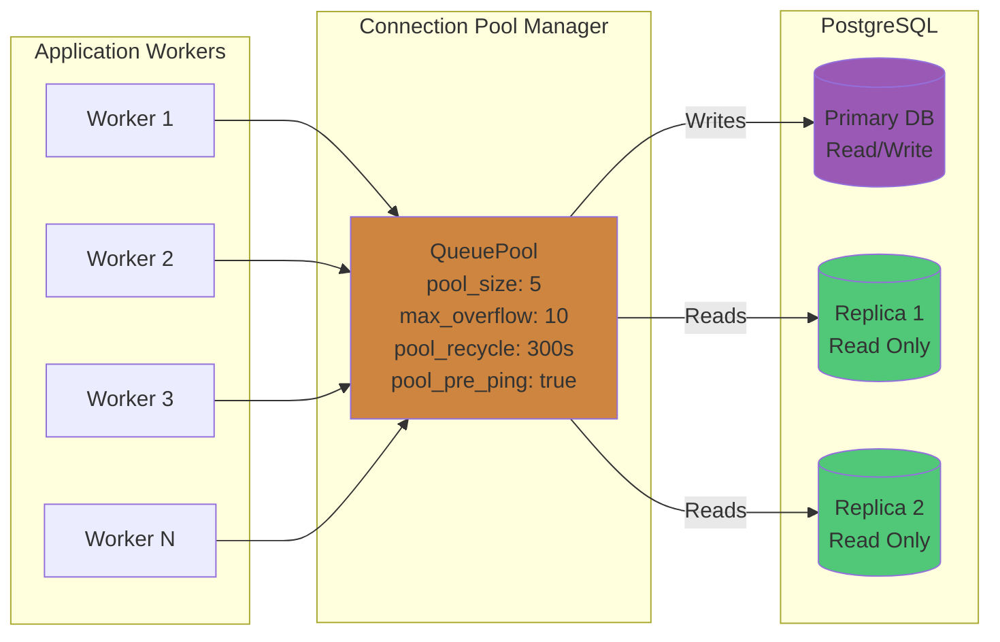
```mermaid
graph LR
    subgraph "Application Workers"
        W1[Worker 1]
        W2[Worker 2]
        W3[Worker 3]
        WN[Worker N]
    end
    
    subgraph "Connection Pool Manager"
        Pool[QueuePool<br/>pool_size: 5<br/>max_overflow: 10<br/>pool_recycle: 300s<br/>pool_pre_ping: true]
    end
    
    subgraph "PostgreSQL"
        Primary[(Primary DB<br/>Read/Write)]
        Replica1[(Replica 1<br/>Read Only)]
        Replica2[(Replica 2<br/>Read Only)]
    end
    
    W1 --> Pool
    W2 --> Pool
    W3 --> Pool
    WN --> Pool
    
    Pool -->|Writes| Primary
    Pool -->|Reads| Replica1
    Pool -->|Reads| Replica2
    
    style Pool fill:#cd853f
    style Primary fill:#9b59b6
    style Replica1 fill:#50c878
    style Replica2 fill:#50c878
```

**Connection Pool Configuration:**
- **Pool Size**: 5 connections per worker
- **Max Overflow**: 10 additional connections
- **Pool Recycle**: 300 seconds (prevent stale connections)
- **Pool Pre-ping**: True (verify connections before use)
- **Connection Timeout**: 30 seconds
- **SSL Mode**: Auto-detected and configured

**Benefits:**
- Reuses connections (faster queries)
- Limits total connections (prevents DB overload)
- Automatic connection health checks
- Handles connection failures gracefully

### Read/Write Splitting Strategy

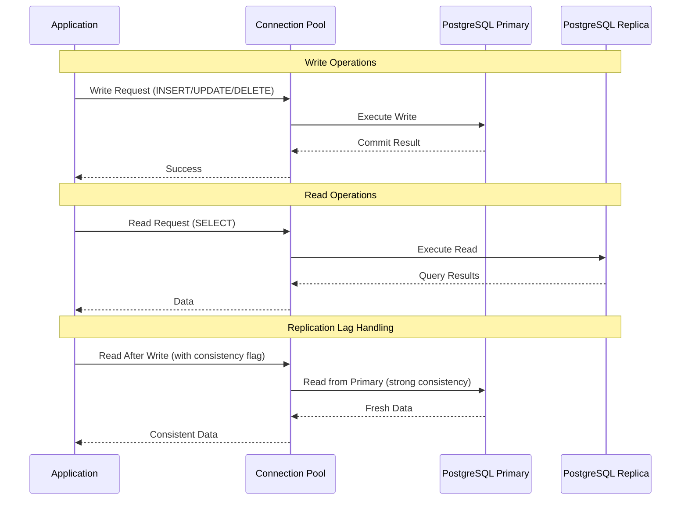
```mermaid
sequenceDiagram
    participant App as Application
    participant Pool as Connection Pool
    participant Primary as PostgreSQL Primary
    participant Replica as PostgreSQL Replica
    
    Note over App,Replica: Write Operations
    App->>Pool: Write Request (INSERT/UPDATE/DELETE)
    Pool->>Primary: Execute Write
    Primary-->>Pool: Commit Result
    Pool-->>App: Success
    
    Note over App,Replica: Read Operations
    App->>Pool: Read Request (SELECT)
    Pool->>Replica: Execute Read
    Replica-->>Pool: Query Results
    Pool-->>App: Data
    
    Note over App,Replica: Replication Lag Handling
    App->>Pool: Read After Write (with consistency flag)
    Pool->>Primary: Read from Primary (strong consistency)
    Primary-->>Pool: Fresh Data
    Pool-->>App: Consistent Data
```

**Read/Write Splitting:**
- **Writes**: Always go to Primary
- **Reads**: Distributed across Replicas
- **Consistency**: Option to read from Primary for critical reads
- **Replication Lag**: Handled with read-after-write patterns

---

## Caching Architecture

### Multi-Layer Caching Strategy

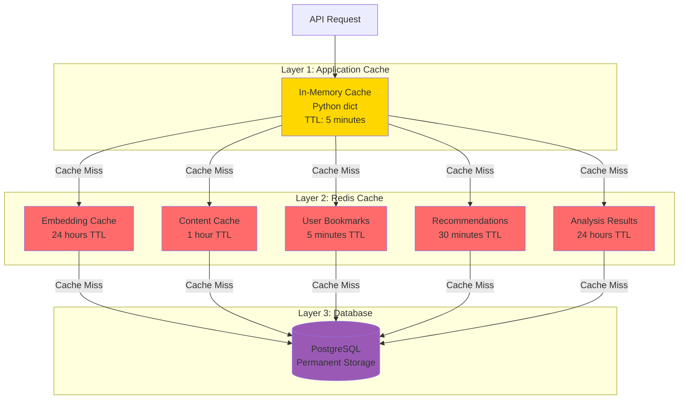
```mermaid
graph TB
    subgraph "Layer 1: Application Cache"
        InMemory[In-Memory Cache<br/>Python dict<br/>TTL: 5 minutes]
    end
    
    subgraph "Layer 2: Redis Cache"
        RedisEmbedding[Embedding Cache<br/>24 hours TTL]
        RedisContent[Content Cache<br/>1 hour TTL]
        RedisUser[User Bookmarks<br/>5 minutes TTL]
        RedisRecommendations[Recommendations<br/>30 minutes TTL]
        RedisAnalysis[Analysis Results<br/>24 hours TTL]
    end
    
    subgraph "Layer 3: Database"
        PostgreSQL[(PostgreSQL<br/>Permanent Storage)]
    end
    
    Request[API Request] --> InMemory
    InMemory -->|Cache Miss| RedisEmbedding
    InMemory -->|Cache Miss| RedisContent
    InMemory -->|Cache Miss| RedisUser
    InMemory -->|Cache Miss| RedisRecommendations
    InMemory -->|Cache Miss| RedisAnalysis
    
    RedisEmbedding -->|Cache Miss| PostgreSQL
    RedisContent -->|Cache Miss| PostgreSQL
    RedisUser -->|Cache Miss| PostgreSQL
    RedisRecommendations -->|Cache Miss| PostgreSQL
    RedisAnalysis -->|Cache Miss| PostgreSQL
    
    style InMemory fill:#ffd700
    style RedisEmbedding fill:#ff6b6b
    style RedisContent fill:#ff6b6b
    style RedisUser fill:#ff6b6b
    style RedisRecommendations fill:#ff6b6b
    style RedisAnalysis fill:#ff6b6b
    style PostgreSQL fill:#9b59b6
```

### Cache Layers Explained

#### Layer 1: In-Memory Cache (Application Level)

**Location**: `backend/utils/redis_utils.py`

**Cached Items:**
- Query results (5 minutes TTL)
- Embedding model instance (singleton)
- Request deduplication results

**Characteristics:**
- Fastest access (in-process)
- Limited to single worker
- Auto-eviction on TTL expiry
- Thread-safe with locks

#### Layer 2: Redis Cache (Shared Across Workers)

**Location**: `backend/utils/redis_utils.py`

**Cache Types:**

1. **Embedding Cache**
   - Key: `fuze:embedding:{content_hash}`
   - TTL: 24 hours
   - Stores: NumPy arrays (pickled)
   - Purpose: Avoid regenerating embeddings

2. **Content Cache**
   - Key: `fuze:scraped:{url_hash}`
   - TTL: 1 hour
   - Stores: Scraped content JSON
   - Purpose: Avoid re-scraping URLs

3. **User Bookmarks Cache**
   - Key: `fuze:user_bookmarks:{user_id}`
   - TTL: 5 minutes
   - Stores: User's bookmark list
   - Purpose: Fast duplicate checking

4. **Recommendation Cache**
   - Key: `fuze:recommendations:{user_id}:{request_hash}`
   - TTL: 30 minutes (configurable)
   - Stores: Recommendation results
   - Purpose: Avoid recomputing recommendations

5. **Analysis Cache**
   - Key: `fuze:content_analysis:{content_id}`
   - TTL: 24 hours
   - Stores: Gemini analysis results
   - Purpose: Reuse AI analysis

**Cache Invalidation Strategy:**

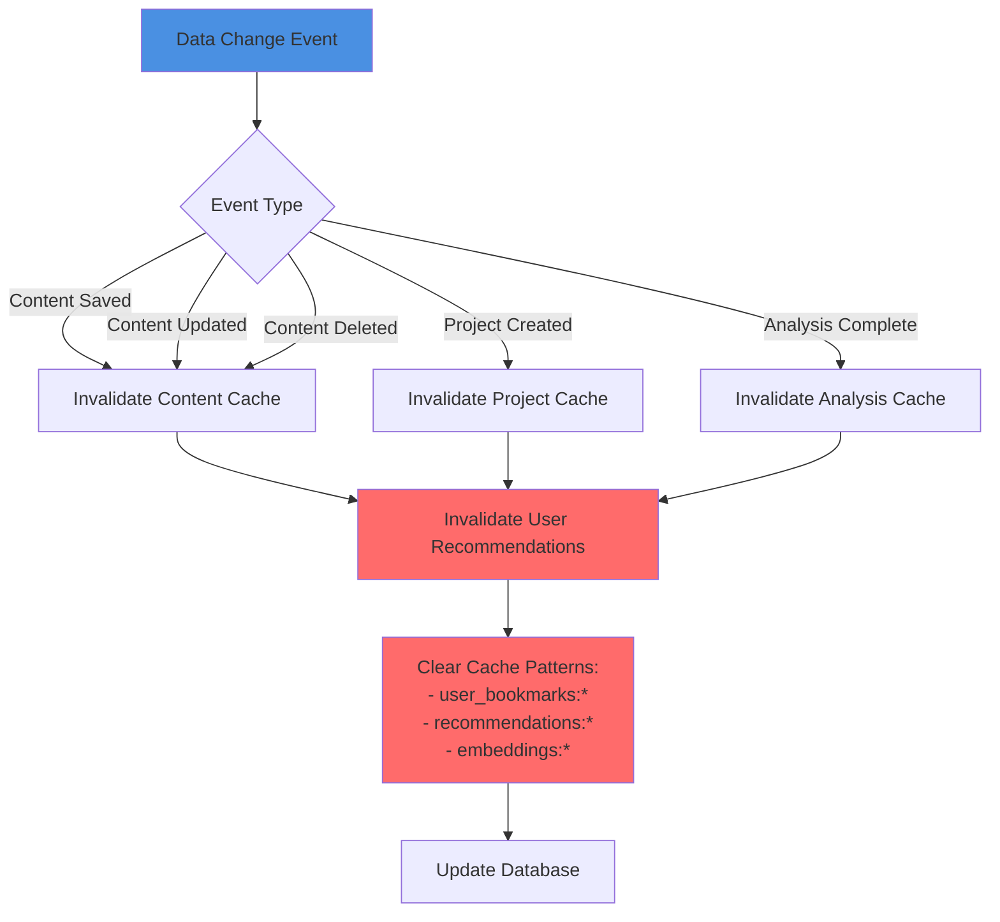
```mermaid
flowchart TD
    Event[Data Change Event] --> Identify{Event Type}
    
    Identify -->|Content Saved| InvalidateContent[Invalidate Content Cache]
    Identify -->|Content Updated| InvalidateContent
    Identify -->|Content Deleted| InvalidateContent
    Identify -->|Project Created| InvalidateProject[Invalidate Project Cache]
    Identify -->|Analysis Complete| InvalidateAnalysis[Invalidate Analysis Cache]
    
    InvalidateContent --> InvalidateUser[Invalidate User Recommendations]
    InvalidateProject --> InvalidateUser
    InvalidateAnalysis --> InvalidateUser
    
    InvalidateUser --> ClearPatterns[Clear Cache Patterns:<br/>- user_bookmarks:*<br/>- recommendations:*<br/>- embeddings:*]
    
    ClearPatterns --> UpdateDB[Update Database]
    
    style Event fill:#4a90e2
    style InvalidateUser fill:#ff6b6b
    style ClearPatterns fill:#ff6b6b
```

**Cache Invalidation Service:**
- Location: `backend/services/cache_invalidation_service.py`
- Automatic invalidation on data changes
- Pattern-based invalidation (wildcards)
- Comprehensive coverage (all related caches)

---

## Horizontal Scaling Strategy

### Stateless Application Design

**Key Principle**: No local state in application workers

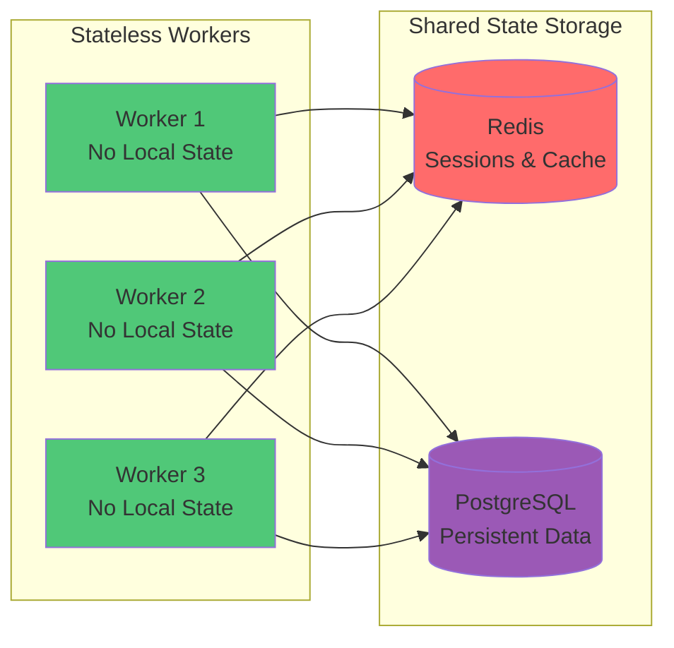
```mermaid
graph LR
    subgraph "Stateless Workers"
        W1[Worker 1<br/>No Local State]
        W2[Worker 2<br/>No Local State]
        W3[Worker 3<br/>No Local State]
    end
    
    subgraph "Shared State Storage"
        Redis[(Redis<br/>Sessions & Cache)]
        DB[(PostgreSQL<br/>Persistent Data)]
    end
    
    W1 --> Redis
    W2 --> Redis
    W3 --> Redis
    
    W1 --> DB
    W2 --> DB
    W3 --> DB
    
    style W1 fill:#50c878
    style W2 fill:#50c878
    style W3 fill:#50c878
    style Redis fill:#ff6b6b
    style DB fill:#9b59b6
```

**Stateless Components:**
- ✅ JWT tokens (no server-side sessions)
- ✅ All state in Redis or Database
- ✅ No file uploads to workers
- ✅ No in-memory caches (shared Redis instead)
- ✅ Connection pooling (managed by SQLAlchemy)

**Benefits:**
- Any worker can handle any request
- Easy to add/remove workers
- No session affinity required
- Horizontal scaling without limits

### User Isolation Architecture

**Critical for Multi-Tenancy:**

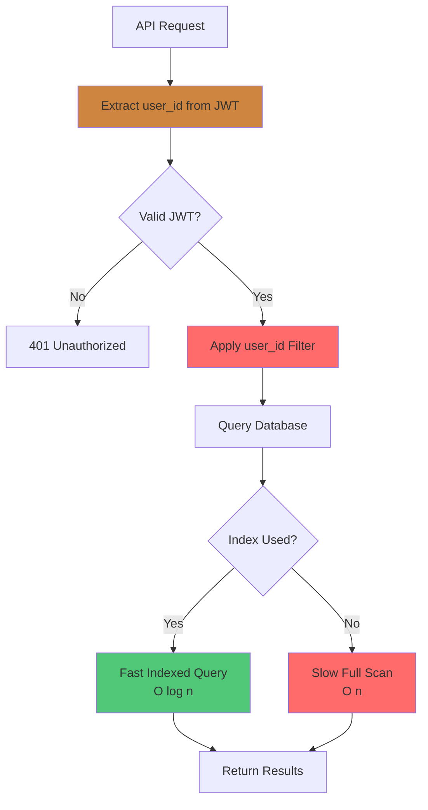
```mermaid
flowchart TD
    Request[API Request] --> ExtractUser[Extract user_id from JWT]
    ExtractUser --> ValidateAuth{Valid JWT?}
    
    ValidateAuth -->|No| Reject[401 Unauthorized]
    ValidateAuth -->|Yes| ApplyFilter[Apply user_id Filter]
    
    ApplyFilter --> QueryDB[Query Database]
    QueryDB --> IndexCheck{Index Used?}
    
    IndexCheck -->|Yes| FastQuery[Fast Indexed Query<br/>O log n]
    IndexCheck -->|No| SlowQuery[Slow Full Scan<br/>O n]
    
    FastQuery --> Results[Return Results]
    SlowQuery --> Results
    
    style ExtractUser fill:#cd853f
    style ApplyFilter fill:#ff6b6b
    style FastQuery fill:#50c878
    style SlowQuery fill:#ff6b6b
```

**User Isolation Implementation:**

1. **Database Level:**
   ```python
   # All queries automatically filtered by user_id
   SavedContent.query.filter_by(user_id=current_user_id).all()
   ```

2. **Index Level:**
   ```sql
   -- Composite indexes ensure fast user-specific queries
   CREATE INDEX idx_saved_content_user_quality 
   ON saved_content(user_id, quality_score DESC);
   ```

3. **Application Level:**
   ```python
   # Security middleware enforces user_id in all queries
   @require_user_context
   def get_user_bookmarks(user_id: int):
       # user_id is guaranteed to be present and valid
   ```

**Benefits:**
- Complete data isolation
- Fast queries (indexed lookups)
- Security at multiple layers
- Scales per-user independently

---

## Load Distribution

### Request Distribution Strategy

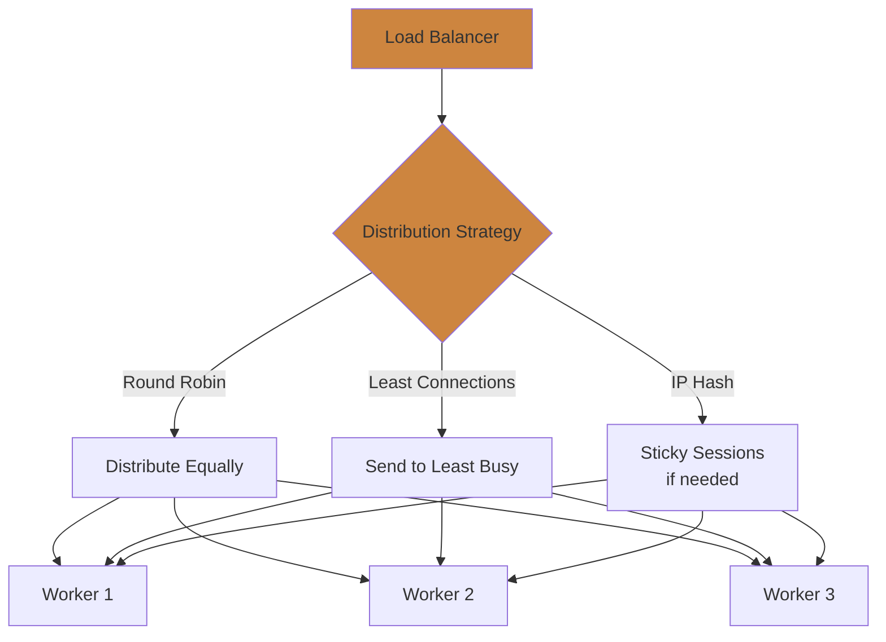
```mermaid
graph TB
    LB[Load Balancer] --> Strategy{Distribution Strategy}
    
    Strategy -->|Round Robin| RR[Distribute Equally]
    Strategy -->|Least Connections| LC[Send to Least Busy]
    Strategy -->|IP Hash| IH[Sticky Sessions<br/>if needed]
    
    RR --> W1[Worker 1]
    RR --> W2[Worker 2]
    RR --> W3[Worker 3]
    
    LC --> W1
    LC --> W2
    LC --> W3
    
    IH --> W1
    IH --> W2
    IH --> W3
    
    style LB fill:#cd853f
    style Strategy fill:#cd853f
```

**Distribution Methods:**
- **Round Robin**: Equal distribution (default)
- **Least Connections**: Send to least busy worker
- **IP Hash**: Sticky sessions (if needed, but not required due to stateless design)

### Database Load Distribution

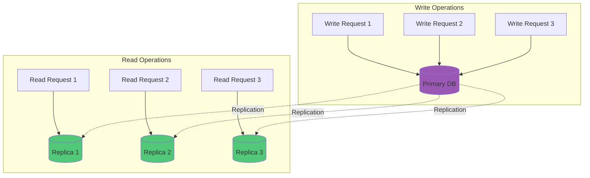
```mermaid
graph TB
    subgraph "Read Operations"
        Read1[Read Request 1] --> Replica1[(Replica 1)]
        Read2[Read Request 2] --> Replica2[(Replica 2)]
        Read3[Read Request 3] --> Replica3[(Replica 3)]
    end
    
    subgraph "Write Operations"
        Write1[Write Request 1] --> Primary[(Primary DB)]
        Write2[Write Request 2] --> Primary
        Write3[Write Request 3] --> Primary
    end
    
    Primary -.->|Replication| Replica1
    Primary -.->|Replication| Replica2
    Primary -.->|Replication| Replica3
    
    style Primary fill:#9b59b6
    style Replica1 fill:#50c878
    style Replica2 fill:#50c878
    style Replica3 fill:#50c878
```

**Read/Write Distribution (Scalable Design - Not Yet Implemented):**
- **Writes**: All to Primary (single source of truth)
- **Reads**: Distributed across Replicas (load balancing)
- **Replication**: Async replication (low latency)
- **Consistency**: Read-after-write uses Primary

**Current Implementation:**
- **All Operations**: Single PostgreSQL database (no replicas)
- **Connection Pooling**: Configured for efficiency
- **Design Ready**: Architecture supports read/write splitting when replicas are added

---

## Data Isolation & Security

### Multi-Tenant Data Isolation

**Three-Layer Isolation:**

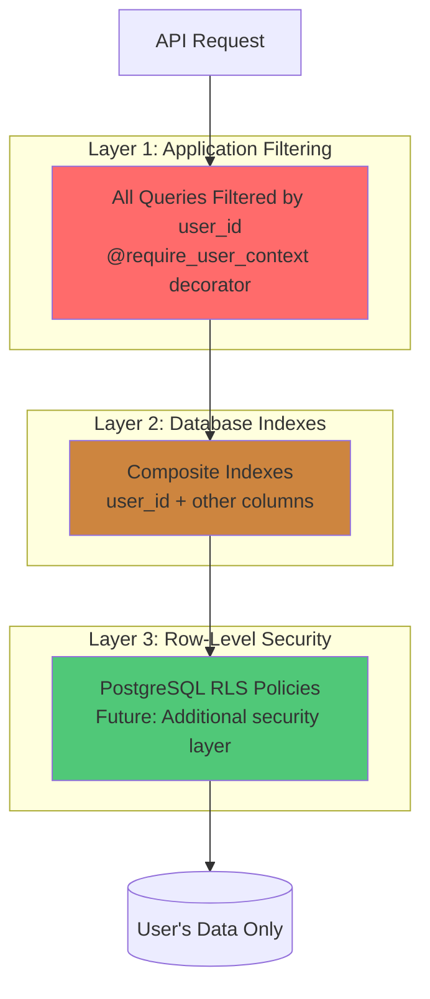
```mermaid
graph TB
    subgraph "Layer 1: Application Filtering"
        AppFilter[All Queries Filtered by user_id<br/>@require_user_context decorator]
    end
    
    subgraph "Layer 2: Database Indexes"
        UserIndex[Composite Indexes<br/>user_id + other columns]
    end
    
    subgraph "Layer 3: Row-Level Security"
        RLS[PostgreSQL RLS Policies<br/>Future: Additional security layer]
    end
    
    Request[API Request] --> AppFilter
    AppFilter --> UserIndex
    UserIndex --> RLS
    RLS --> Data[(User's Data Only)]
    
    style AppFilter fill:#ff6b6b
    style UserIndex fill:#cd853f
    style RLS fill:#50c878
```

**Isolation Mechanisms:**

1. **Application Level:**
   - All queries include `user_id` filter
   - Decorators enforce user context
   - Input validation prevents injection

2. **Database Level:**
   - Composite indexes on `user_id`
   - Foreign keys with CASCADE
   - Unique constraints per user

3. **API Level:**
   - JWT token contains `user_id`
   - Token validation on every request
   - No cross-user data access possible

### Security Architecture

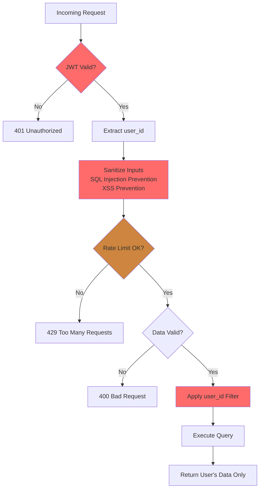
```mermaid
graph TB
    Request[Incoming Request] --> ValidateJWT{JWT Valid?}
    
    ValidateJWT -->|No| Reject[401 Unauthorized]
    ValidateJWT -->|Yes| ExtractUser[Extract user_id]
    
    ExtractUser --> SanitizeInput[Sanitize Inputs<br/>SQL Injection Prevention<br/>XSS Prevention]
    SanitizeInput --> RateLimit{Rate Limit OK?}
    
    RateLimit -->|No| RateLimitError[429 Too Many Requests]
    RateLimit -->|Yes| ValidateData{Data Valid?}
    
    ValidateData -->|No| ValidationError[400 Bad Request]
    ValidateData -->|Yes| ApplyUserFilter[Apply user_id Filter]
    
    ApplyUserFilter --> ExecuteQuery[Execute Query]
    ExecuteQuery --> ReturnData[Return User's Data Only]
    
    style ValidateJWT fill:#ff6b6b
    style SanitizeInput fill:#ff6b6b
    style RateLimit fill:#cd853f
    style ApplyUserFilter fill:#ff6b6b
```

---

## Background Processing Architecture

### Async Processing Design

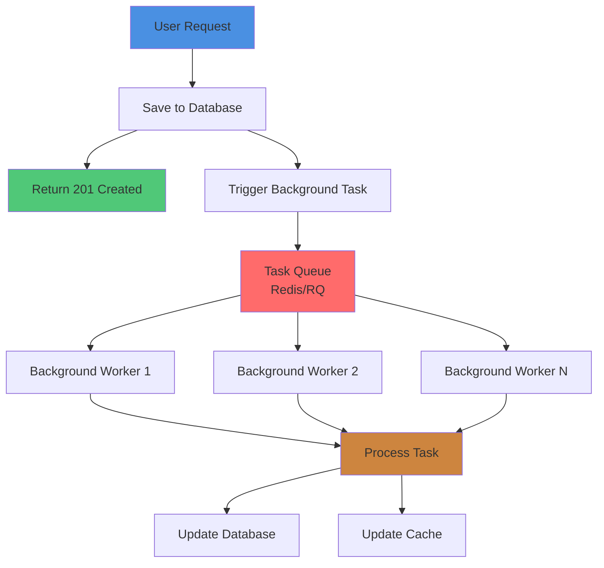
```mermaid
graph TB
    Request[User Request] --> SaveData[Save to Database]
    SaveData --> ReturnResponse[Return 201 Created]
    SaveData --> TriggerAsync[Trigger Background Task]
    
    TriggerAsync --> Queue[Task Queue<br/>Redis/RQ]
    
    Queue --> Worker1[Background Worker 1]
    Queue --> Worker2[Background Worker 2]
    Queue --> WorkerN[Background Worker N]
    
    Worker1 --> ProcessTask[Process Task]
    Worker2 --> ProcessTask
    WorkerN --> ProcessTask
    
    ProcessTask --> UpdateDB[Update Database]
    ProcessTask --> UpdateCache[Update Cache]
    
    style Request fill:#4a90e2
    style ReturnResponse fill:#50c878
    style Queue fill:#ff6b6b
    style ProcessTask fill:#cd853f
```

**Background Services (Current Implementation):**

1. **RQ (Redis Queue) Worker** ⭐ **Primary Background System**
   - Location: `backend/worker.py` and `backend/services/task_queue.py`
   - Processes: Bookmark content extraction, embedding generation, analysis
   - Queue System: Redis-based task queue
   - Runs: Automatically alongside web server (via `start.sh`)
   - Deployment: 1 RQ worker in same container as web server

2. **Content Analysis Service**
   - Location: `backend/services/background_analysis_service.py`
   - Processes: Unanalyzed bookmarks
   - Uses: User's own Gemini API key
   - Runs: Continuously (every 30 seconds)

3. **Cache Invalidation Service**
   - Location: `backend/services/cache_invalidation_service.py`
   - Processes: Cache invalidation on data changes
   - Runs: Synchronously (on data mutations)

4. **Import Processing**
   - Location: `backend/blueprints/bookmarks.py`
   - Processes: Bulk bookmark imports
   - Uses: ThreadPoolExecutor for parallel processing
   - Progress: Tracked via SSE streams

### RQ Worker Architecture

**How It Works:**

```
User Action → API Endpoint → Enqueue Job → Immediate Response
                                      ↓
                              RQ Worker → Process Content → Update Database
```

**Components:**

1. **Task Queue Service** (`backend/services/task_queue.py`)
   - Manages RQ queues and job enqueueing
   - Handles Redis connection
   - Provides job status checking
   - Automatic fallback to threading if Redis unavailable

2. **Bookmark Processing Task** (`backend/blueprints/bookmarks.py`)
   - `process_bookmark_content_task()`: The actual task function that RQ workers execute
   - Handles content extraction, embedding generation, and analysis
   - Updates bookmark with full data after processing

3. **RQ Worker** (`backend/worker.py`)
   - Background process that listens to queues and executes tasks
   - Can run multiple workers for parallel processing
   - Automatic retry logic (up to 2 retries with exponential backoff)
   - Job timeout: 10 minutes per job

**Queue Configuration:**

- **Default Queue**: Normal priority bookmark processing
- **High Priority Queue**: Urgent tasks (optional)
- **Retry Logic**: 2 attempts (after 1min, then 5min)
- **Job Timeout**: 10 minutes per job

**Current Deployment (Hugging Face Spaces):**

The RQ worker runs automatically:
- ✅ `start.sh` script starts both RQ worker and Gunicorn
- ✅ Both processes run in the same Docker container
- ✅ Worker uses same Redis connection as web server
- ✅ No manual configuration needed
- ✅ 1 RQ worker handles all background jobs

**Scalable Deployment (Future):**
- Can run RQ workers on separate machines
- Can scale RQ workers independently
- Multiple workers can process jobs in parallel

**Benefits:**
- Non-blocking user requests
- Parallel processing
- User-specific API key usage
- Progress tracking for long operations
- Jobs survive server restarts (persistent queue)
- Automatic retries on failure
- Better scalability (can run workers on separate machines)

---

## ML/AI Architecture

### Embedding Model Architecture

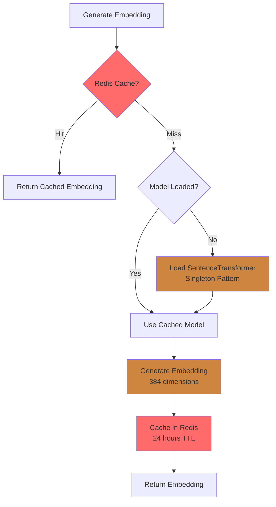
```mermaid
graph TB
    Request[Generate Embedding] --> CheckCache{Redis Cache?}
    
    CheckCache -->|Hit| ReturnCached[Return Cached Embedding]
    CheckCache -->|Miss| CheckModel{Model Loaded?}
    
    CheckModel -->|No| LoadModel[Load SentenceTransformer<br/>Singleton Pattern]
    CheckModel -->|Yes| UseModel[Use Cached Model]
    
    LoadModel --> UseModel
    UseModel --> GenerateEmbedding[Generate Embedding<br/>384 dimensions]
    GenerateEmbedding --> CacheResult[Cache in Redis<br/>24 hours TTL]
    CacheResult --> ReturnEmbedding[Return Embedding]
    
    style CheckCache fill:#ff6b6b
    style LoadModel fill:#cd853f
    style GenerateEmbedding fill:#cd853f
    style CacheResult fill:#ff6b6b
```

**Model Management:**
- **Singleton Pattern**: One model instance per worker
- **Lazy Loading**: Model loaded on first use (prevents OOM at startup)
- **Thread Safety**: Locking prevents race conditions
- **Fallback Model**: Works even if primary model fails
- **Redis Caching**: Embeddings cached to avoid regeneration

### Recommendation Orchestrator Architecture

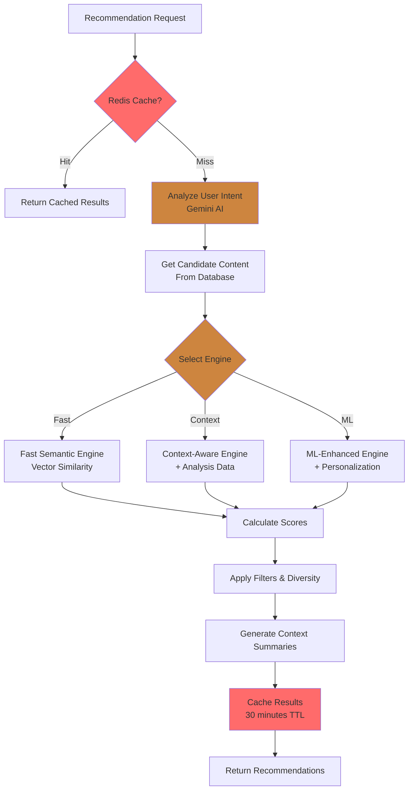
```mermaid
graph TB
    Request[Recommendation Request] --> CheckCache{Redis Cache?}
    
    CheckCache -->|Hit| ReturnCached[Return Cached Results]
    CheckCache -->|Miss| AnalyzeIntent[Analyze User Intent<br/>Gemini AI]
    
    AnalyzeIntent --> GetCandidates[Get Candidate Content<br/>From Database]
    GetCandidates --> SelectEngine{Select Engine}
    
    SelectEngine -->|Fast| FastEngine[Fast Semantic Engine<br/>Vector Similarity]
    SelectEngine -->|Context| ContextEngine[Context-Aware Engine<br/>+ Analysis Data]
    SelectEngine -->|ML| MLEngine[ML-Enhanced Engine<br/>+ Personalization]
    
    FastEngine --> CalculateScores[Calculate Scores]
    ContextEngine --> CalculateScores
    MLEngine --> CalculateScores
    
    CalculateScores --> ApplyFilters[Apply Filters & Diversity]
    ApplyFilters --> GenerateSummaries[Generate Context Summaries]
    GenerateSummaries --> CacheResults[Cache Results<br/>30 minutes TTL]
    CacheResults --> ReturnResults[Return Recommendations]
    
    style CheckCache fill:#ff6b6b
    style AnalyzeIntent fill:#cd853f
    style SelectEngine fill:#cd853f
    style CacheResults fill:#ff6b6b
```

**Orchestrator Features:**
- **Multi-Engine Strategy**: Fast, Context-Aware, ML-Enhanced
- **Intent Analysis**: Understands user goals (learn/build/explore)
- **Caching**: Results cached with intent-aware keys
- **Fallback**: Works even if AI services unavailable
- **Performance**: Sub-second responses for cached requests

---

## API Architecture

### Blueprint-Based Modular Design

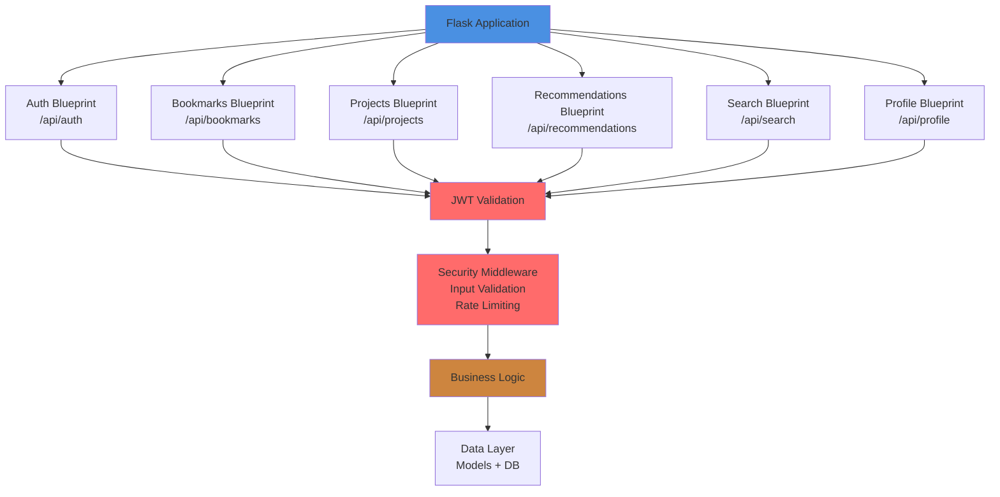
```mermaid
graph TB
    App[Flask Application] --> AuthBP[Auth Blueprint<br/>/api/auth]
    App --> BookmarksBP[Bookmarks Blueprint<br/>/api/bookmarks]
    App --> ProjectsBP[Projects Blueprint<br/>/api/projects]
    App --> RecommendationsBP[Recommendations Blueprint<br/>/api/recommendations]
    App --> SearchBP[Search Blueprint<br/>/api/search]
    App --> ProfileBP[Profile Blueprint<br/>/api/profile]
    
    AuthBP --> AuthMiddleware[JWT Validation]
    BookmarksBP --> AuthMiddleware
    ProjectsBP --> AuthMiddleware
    RecommendationsBP --> AuthMiddleware
    SearchBP --> AuthMiddleware
    ProfileBP --> AuthMiddleware
    
    AuthMiddleware --> SecurityMiddleware[Security Middleware<br/>Input Validation<br/>Rate Limiting]
    
    SecurityMiddleware --> BusinessLogic[Business Logic]
    BusinessLogic --> DataLayer[Data Layer<br/>Models + DB]
    
    style App fill:#4a90e2
    style AuthMiddleware fill:#ff6b6b
    style SecurityMiddleware fill:#ff6b6b
    style BusinessLogic fill:#cd853f
```

**Blueprint Benefits:**
- **Modularity**: Each feature in separate blueprint
- **Maintainability**: Easy to locate and modify code
- **Testability**: Each blueprint can be tested independently
- **Scalability**: Can split blueprints to separate services if needed

### Request Flow Architecture

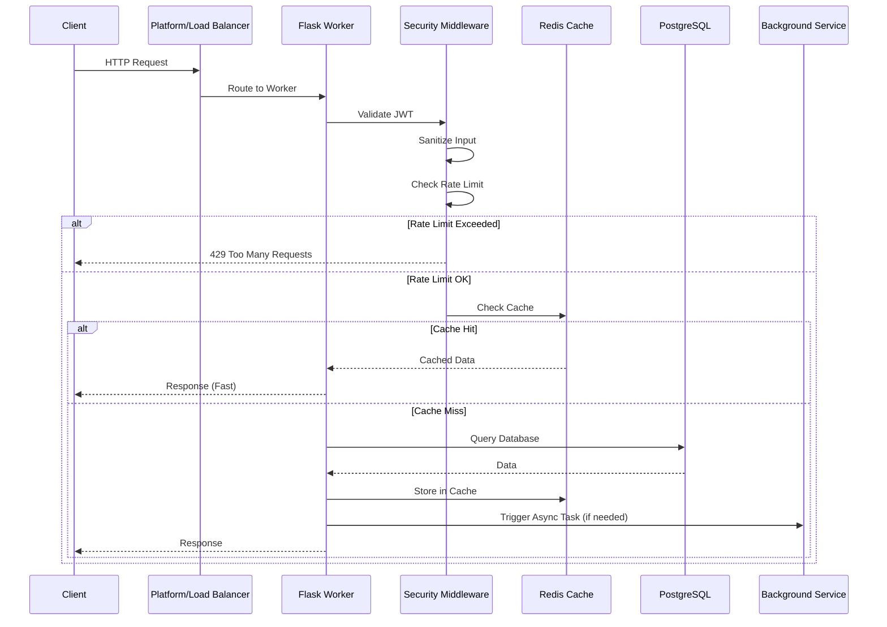
```mermaid
sequenceDiagram
    participant Client
    participant LB as Platform/Load Balancer
    participant Worker as Flask Worker
    participant Middleware as Security Middleware
    participant Cache as Redis Cache
    participant DB as PostgreSQL
    participant Background as Background Service
    
    Client->>LB: HTTP Request
    LB->>Worker: Route to Worker
    Worker->>Middleware: Validate JWT
    Middleware->>Middleware: Sanitize Input
    Middleware->>Middleware: Check Rate Limit
    
    alt Rate Limit Exceeded
        Middleware-->>Client: 429 Too Many Requests
    else Rate Limit OK
        Middleware->>Cache: Check Cache
        alt Cache Hit
            Cache-->>Worker: Cached Data
            Worker-->>Client: Response (Fast)
        else Cache Miss
            Worker->>DB: Query Database
            DB-->>Worker: Data
            Worker->>Cache: Store in Cache
            Worker->>Background: Trigger Async Task (if needed)
            Worker-->>Client: Response
        end
    end
```

---

## Frontend Architecture

### React Application Structure

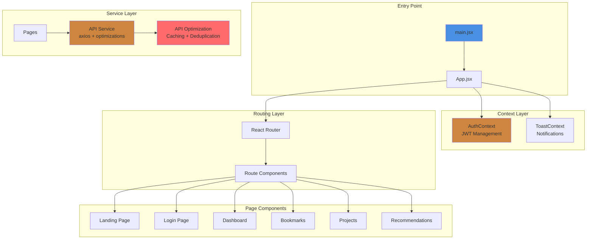
```mermaid
graph TB
    subgraph "Entry Point"
        Main[main.jsx] --> App[App.jsx]
    end
    
    subgraph "Context Layer"
        App --> AuthContext[AuthContext<br/>JWT Management]
        App --> ToastContext[ToastContext<br/>Notifications]
    end
    
    subgraph "Routing Layer"
        App --> Router[React Router]
        Router --> Routes[Route Components]
    end
    
    subgraph "Page Components"
        Routes --> Landing[Landing Page]
        Routes --> Login[Login Page]
        Routes --> Dashboard[Dashboard]
        Routes --> Bookmarks[Bookmarks]
        Routes --> Projects[Projects]
        Routes --> Recommendations[Recommendations]
    end
    
    subgraph "Service Layer"
        Pages --> API[API Service<br/>axios + optimizations]
        API --> Cache[API Optimization<br/>Caching + Deduplication]
    end
    
    style Main fill:#4a90e2
    style AuthContext fill:#cd853f
    style API fill:#cd853f
    style Cache fill:#ff6b6b
```

**Frontend Optimizations:**

1. **API Call Optimization**
   - Location: `frontend/src/utils/apiOptimization.js`
   - Features:
     - Request debouncing (300ms)
     - Request batching (50ms window)
     - Response caching (5 minutes TTL)
     - Request deduplication

2. **Code Splitting**
   - React vendor chunk
   - Axios vendor chunk
   - Route-based lazy loading (future)

3. **State Management**
   - React Context for global state
   - Local state for component state
   - No Redux (keeps it simple)

---

## Deployment Architecture

### Current Deployment Stack (What's Actually Running)

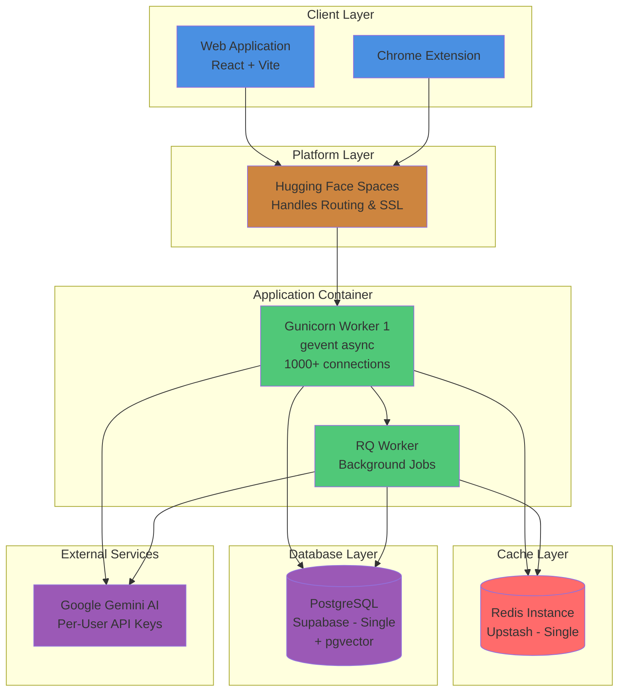
```mermaid
graph TB
    subgraph "Client Layer"
        WebApp[Web Application<br/>React + Vite]
        Extension[Chrome Extension]
    end
    
    subgraph "Platform Layer"
        Platform[Hugging Face Spaces<br/>Handles Routing & SSL]
    end
    
    subgraph "Application Container"
        App1[Gunicorn Worker 1<br/>gevent async<br/>1000+ connections]
        RQWorker[RQ Worker<br/>Background Jobs]
    end
    
    subgraph "Cache Layer"
        Redis[(Redis Instance<br/>Upstash - Single)]
    end
    
    subgraph "Database Layer"
        Primary[(PostgreSQL<br/>Supabase - Single<br/>+ pgvector)]
    end
    
    subgraph "External Services"
        Gemini[Google Gemini AI<br/>Per-User API Keys]
    end
    
    WebApp --> Platform
    Extension --> Platform
    
    Platform --> App1
    
    App1 --> Redis
    App1 --> Primary
    App1 --> Gemini
    
    App1 --> RQWorker
    RQWorker --> Redis
    RQWorker --> Primary
    RQWorker --> Gemini
    
    style WebApp fill:#4a90e2
    style Extension fill:#4a90e2
    style Platform fill:#cd853f
    style App1 fill:#50c878
    style RQWorker fill:#50c878
    style Redis fill:#ff6b6b
    style Primary fill:#9b59b6
    style Gemini fill:#9b59b6
```

### Scalable Deployment Stack (Future-Ready Design)

```mermaid
graph TB
    subgraph "CDN & Edge"
        CDN[Cloudflare/CDN<br/>Static Assets]
    end
    
    subgraph "Load Balancer"
        LB[Nginx/Cloudflare<br/>SSL Termination<br/>Rate Limiting]
    end
    
    subgraph "Application Servers"
        App1[Gunicorn Worker 1<br/>4 workers]
        App2[Gunicorn Worker 2<br/>4 workers]
        AppN[Gunicorn Worker N<br/>4 workers]
    end
    
    subgraph "Cache Layer"
        Redis[(Redis Cluster<br/>High Availability)]
    end
    
    subgraph "Database Layer"
        Primary[(PostgreSQL Primary<br/>Write Operations)]
        Replica1[(PostgreSQL Replica 1<br/>Read Operations)]
        Replica2[(PostgreSQL Replica 2<br/>Read Operations)]
    end
    
    subgraph "Background Workers"
        BG1[RQ Worker 1]
        BG2[RQ Worker 2]
    end
    
    CDN --> LB
    LB --> App1
    LB --> App2
    LB --> AppN
    
    App1 --> Redis
    App2 --> Redis
    AppN --> Redis
    
    App1 --> Primary
    App2 --> Replica1
    AppN --> Replica2
    
    BG1 --> Redis
    BG2 --> Redis
    BG1 --> Primary
    BG2 --> Primary
    
    Primary -.->|Replication| Replica1
    Primary -.->|Replication| Replica2
    
    style CDN fill:#4a90e2
    style LB fill:#cd853f
    style App1 fill:#50c878
    style Redis fill:#ff6b6b
    style Primary fill:#9b59b6
```

### Current Deployment Configuration

**Application Servers (Current):**
- **Gunicorn Workers**: 1 worker (gevent async)
- **Worker Class**: gevent (handles 1000+ concurrent connections)
- **Worker Connections**: 1000 per worker
- **Deployment**: Hugging Face Spaces (single container)
- **Health Checks**: `/api/health` endpoint

**Database (Current):**
- **Connection Pool**: 5 base connections, 10 overflow
- **Single Database**: All operations to one PostgreSQL instance
- **Connection Manager**: Auto-recovery on failures
- **Indexes**: 24 production indexes for performance

**Redis (Current):**
- **Single Instance**: Upstash (free tier)
- **Shared**: All workers use same Redis
- **Sufficient**: For current scale

**Background Workers (Current):**
- **RQ Workers**: 1 RQ worker (separate from web worker)
- **Queue**: Redis as message broker
- **Deployment**: Runs in same container as web server

### Scalable Design Configuration (Future)

**Application Servers (Scalable):**
- **Gunicorn Workers**: 4+ workers per server
- **Threads**: 2 threads per worker (if needed)
- **Auto-scaling**: Based on CPU/memory metrics
- **Multiple Servers**: With load balancer

**Database (Scalable):**
- **Connection Pool**: 5 base connections per worker, 10 overflow
- **Max Overflow**: 10 additional connections
- **Read Replicas**: Scale horizontally
- **Read/Write Splitting**: Writes to primary, reads from replicas

**Redis (Scalable):**
- **Cluster Mode**: For high availability
- **Replication**: Master-replica setup
- **Persistence**: RDB + AOF (if needed)

**Background Workers (Scalable):**
- **RQ Workers**: Multiple workers (separate from web workers)
- **Queue**: Redis as message broker
- **Scaling**: Independent of web workers
- **Note**: Already using RQ (not Celery) - architecture is correct

---

## Scalability Metrics

### Current Capacity (Actual Implementation)

**Current Deployment (Hugging Face Spaces):**
- **Gunicorn**: 1 worker (gevent async, 1000+ connections per worker)
- **Concurrent Users**: 50-100 (estimated based on typical usage)
- **Requests/Second**: 20-50 (depending on operation complexity)
- **Database Connections**: 5-15 (pool_size=5, max_overflow=10)
- **Cache Hit Rate**: 70-80% (Redis + in-memory caching)
- **Background Jobs**: RQ worker processes ~10-50 jobs/hour
- **Memory Usage**: ~2-4GB of 16GB available (room for growth)

**Current Performance:**
- **Cached Requests**: 50-200ms
- **Database Queries**: 100-500ms (indexed)
- **Recommendations**: 200-2000ms (depending on cache)
- **Background Tasks**: Async (non-blocking)

**Current Throughput:**
- **Read Operations**: 50-100 req/s (single database)
- **Write Operations**: 20-50 req/s (single database)
- **Cache Operations**: 10,000+ req/s (Redis)

### Scalable Design Capacity (Future)

**Scalable Deployment (With Multiple Workers):**
- **Gunicorn**: 4+ workers per server
- **Concurrent Users**: 100-200 per server (with 4 workers)
- **Requests/Second**: 50-100 per server (depending on operation)
- **Database Connections**: 20-30 per server (with pooling)
- **Cache Hit Rate**: 70-80% (with Redis)

**Scalable Performance:**
- **Cached Requests**: 50-200ms
- **Database Queries**: 100-500ms (indexed, with replicas)
- **Recommendations**: 200-2000ms (depending on cache)
- **Background Tasks**: Async (non-blocking)

**Scalable Throughput:**
- **Read Operations**: 1000+ req/s (with replicas)
- **Write Operations**: 100-200 req/s (primary DB)
- **Cache Operations**: 10,000+ req/s (Redis cluster)

### Scaling Strategy Summary

**Immediate Scaling (Within Current Platform):**
- **Vertical Scaling**: Upgrade HF Spaces hardware (CPU, RAM)
- **Connection Optimization**: Increase gevent workers or connections per worker
- **Database Optimization**: More aggressive caching, query optimization
- **Background Processing**: Multiple RQ workers in same container

**Horizontal Scaling (Future Architecture):**
- **Application Layer**: Add more HF Spaces containers with load balancer
- **Database Layer**: Add PostgreSQL read replicas for read operations
- **Cache Layer**: Redis cluster with sharding across multiple instances
- **Background Workers**: Distributed RQ workers across multiple containers

**Key Scaling Principles:**
- **Stateless Design**: Any worker can handle any request (no session affinity)
- **Shared Nothing**: Redis/DB provide shared state across all instances
- **Connection Pooling**: Efficient database connection management
- **Circuit Breakers**: Graceful degradation when services are unavailable

---

## Key Scalability Features

### 1. Stateless Design
- ✅ No server-side sessions
- ✅ JWT tokens (self-contained)
- ✅ Shared Redis for state
- ✅ Any worker handles any request

### 2. Connection Pooling
- ✅ Efficient database connections
- ✅ Automatic connection recovery
- ✅ Configurable pool sizes
- ✅ Health checks (pool_pre_ping)

### 3. Multi-Layer Caching
- ✅ In-memory cache (fastest)
- ✅ Redis cache (shared)
- ✅ Database (persistent)
- ✅ Smart invalidation

### 4. Background Processing
- ✅ Non-blocking operations
- ✅ User-specific API keys
- ✅ Parallel processing
- ✅ Progress tracking

### 5. Database Optimization
- ✅ Comprehensive indexes
- ✅ Read/write splitting
- ✅ Connection pooling
- ✅ Query optimization

### 6. User Isolation
- ✅ Complete data separation
- ✅ Per-user rate limits
- ✅ Independent processing
- ✅ Security at all layers

---

Ujjwal Jain


