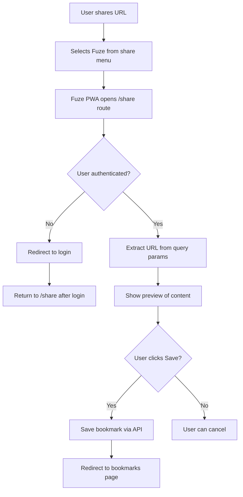

# PWA (Progressive Web App) Guide

Complete guide for Fuze's Progressive Web App functionality, including installation, share target, and testing.

## Table of Contents

1. [Overview](#overview)
2. [Features](#features)
3. [Implementation](#implementation)
4. [Share Functionality](#share-functionality)
5. [Testing Guide](#testing-guide)
6. [Troubleshooting](#troubleshooting)

---

## Overview

Fuze is a fully functional Progressive Web App (PWA) that can be installed on mobile and desktop devices. It provides:

- ✅ **Offline Support** - Cached pages work offline
- ✅ **App-like Experience** - Standalone window, no browser UI
- ✅ **Share Target** - Receive shared URLs from other apps (LinkedIn, browsers, etc.)
- ✅ **Fast Loading** - Service worker caching for instant loads
- ✅ **Mobile Optimized** - Responsive design, touch-friendly

---

## Features

### 1. PWA Installation

Users can install Fuze as a native app on:
- **Desktop** (Chrome, Edge, Safari)
- **Android** (Chrome, Edge, Samsung Internet)
- **iOS** (Safari - limited support)

### 2. Share Target API

Users can share URLs directly to Fuze from:
- LinkedIn app
- Browsers
- Other apps that support sharing

### 3. Service Worker

- Caches static assets
- Enables offline functionality
- Provides fast page loads
- Automatically updates when new version is deployed

### 4. Manifest Configuration

- App name, icons, theme colors
- Display mode (standalone)
- Start URL
- Share target configuration

---

## Implementation

### Files Structure

```
frontend/
├── public/
│   ├── manifest.json      # PWA manifest
│   └── sw.js              # Service worker
├── src/
│   ├── main.jsx          # Service worker registration
│   └── pages/
│       └── ShareHandler.jsx  # Share handler page
└── index.html            # Manifest link
```

### Manifest Configuration

**File**: `public/manifest.json`

```json
{
  "name": "Fuze - Intelligent Bookmark Manager",
  "short_name": "Fuze",
  "description": "AI-powered bookmark management",
  "start_url": "/",
  "display": "standalone",
  "theme_color": "#6366f1",
  "background_color": "#ffffff",
  "icons": [...],
  "share_target": {
    "action": "/share",
    "method": "GET",
    "params": {
      "title": "title",
      "text": "text",
      "url": "url"
    }
  }
}
```

### Service Worker

**File**: `frontend/public/sw.js`

- Caches static assets
- Bypasses API calls (doesn't cache them)
- Handles offline scenarios
- Auto-updates on new deployments

### Share Handler

**File**: `frontend/src/pages/ShareHandler.jsx`

- Extracts URL, title, and text from share intent
- Shows preview of shared content
- Integrates with bookmark save endpoint
- Handles authentication redirects

### Route Configuration

**File**: `frontend/src/App.jsx`

```jsx
<Route path="/share" element={<ShareHandler />} />
```

---

## Share Functionality

### How It Works

1. **User shares a URL** from LinkedIn app or browser
2. **Selects "Fuze"** from share menu
3. **Fuze PWA opens** to `/share` route
4. **URL is extracted** from query parameters
5. **Content is previewed** (if extraction available)
6. **User saves bookmark** with one click
7. **Redirects to bookmarks page**

### Share Target Configuration

The manifest includes `share_target` configuration:

```json
"share_target": {
  "action": "/share",
  "method": "GET",
  "params": {
    "title": "title",
    "text": "text",
    "url": "url"
  }
}
```

### Share Handler Flow



### Supported Share Sources

- ✅ LinkedIn app (Android/iOS)
- ✅ Chrome browser (Android)
- ✅ Safari browser (iOS - limited)
- ✅ Other apps with share functionality

### LinkedIn Integration

When a LinkedIn post URL is shared:
- Backend automatically detects LinkedIn URL
- Extracts post content, author, and metadata
- Generates preview with title and description
- Saves as bookmark with full content

---

## Testing Guide

### Prerequisites

1. **HTTPS Required**: PWAs require HTTPS (except localhost)
2. **PWA Installation**: The app must be installed as a PWA
3. **Mobile Device**: Testing requires a mobile device (Android/iOS)

### Test 1: Service Worker Registration

**Steps:**
1. Open `https://itsfuze.vercel.app` in Chrome
2. Open DevTools → Application tab → Service Workers
3. Check if service worker is registered

**Expected:**
- ✅ Service worker shows as "activated and is running"
- ✅ Scope: `https://itsfuze.vercel.app/`
- ✅ No errors in console

### Test 2: PWA Installation (Desktop)

**Steps:**
1. Open `https://itsfuze.vercel.app` in Chrome
2. Look for install button in address bar (or menu)
3. Click "Install" or "Add to Home Screen"

**Expected:**
- ✅ Install prompt appears
- ✅ App installs successfully
- ✅ App opens in standalone window (no browser UI)
- ✅ App icon appears in applications/taskbar

### Test 3: PWA Installation (Mobile - Android)

**Steps:**
1. Open `https://itsfuze.vercel.app` in Chrome on Android
2. Tap menu (3 dots) → "Add to Home screen" or "Install app"
3. Confirm installation

**Expected:**
- ✅ Install prompt appears
- ✅ App icon added to home screen
- ✅ App opens in standalone mode (no browser UI)
- ✅ App works offline (cached pages)

### Test 4: PWA Installation (Mobile - iOS)

**Steps:**
1. Open `https://itsfuze.vercel.app` in Safari on iOS
2. Tap Share button
3. Tap "Add to Home Screen"
4. Confirm

**Expected:**
- ✅ App icon added to home screen
- ✅ App opens in standalone mode
- ✅ Status bar styling matches theme-color

### Test 5: Share Target (Mobile)

**Steps:**
1. Install PWA on mobile device
2. Open a LinkedIn post in browser
3. Tap Share button
4. Look for "Fuze" in share options
5. Select "Fuze"
6. App should open with shared URL

**Expected:**
- ✅ "Fuze" appears in share menu
- ✅ App opens to `/share` route
- ✅ URL is extracted from share
- ✅ User can save the bookmark

### Test 6: Share from LinkedIn App

**Steps:**
1. Open LinkedIn app on Android
2. Find a post you want to share
3. Tap the Share button on the post
4. Select "Fuze" from the share menu
5. The Fuze app should open with the shared URL
6. Verify the preview is shown correctly
7. Tap "Save Bookmark"
8. Verify it redirects to bookmarks page
9. Check that the bookmark appears in your bookmarks list

### Test 7: Offline Functionality

**Steps:**
1. Install PWA
2. Open app and navigate to different pages
3. Turn off internet/WiFi
4. Try to navigate within the app

**Expected:**
- ✅ Cached pages still load
- ✅ App doesn't show "No internet" error immediately
- ✅ Navigation between cached pages works
- ✅ API calls fail gracefully (show error message)

### Test 8: Edge Cases

#### No URL Provided
- Navigate to `/share` without URL parameter
- Should show error message
- Should provide option to go to dashboard

#### Invalid URL
- Share a malformed URL
- Should handle gracefully
- Should still allow saving (may have limited preview)

#### Not Authenticated
- Share while logged out
- Should redirect to login
- Should preserve share URL in redirect
- After login, should return to share handler

#### Network Issues
- Test with poor/no connectivity
- Should show appropriate error messages
- Should allow retry

---

## Troubleshooting

### Service Worker Not Registering

**Symptoms:**
- No service worker in DevTools → Application → Service Workers
- Console shows "Service worker file not found"

**Fixes:**
- Verify `sw.js` exists in `frontend/public/` directory
- Check Vercel build includes `sw.js` in output
- Verify `sw.js` is accessible at `/sw.js` URL
- Check file permissions

### API Calls Blocked by Service Worker

**Symptoms:**
- API calls show as "canceled" or "failed"
- Network tab shows requests intercepted by service worker
- SSE streams don't work

**Fixes:**
- Verify service worker fetch handler bypasses `/api/` requests
- Verify service worker fetch handler bypasses external requests
- Check service worker code for proper `return;` statements
- Unregister service worker and re-register

### Install Prompt Not Appearing

**Symptoms:**
- No install button in browser
- "Add to Home Screen" not available

**Fixes:**
- Verify manifest.json is valid
- Check all required manifest fields are present
- Ensure app is served over HTTPS
- Check if app is already installed
- Try in incognito/private mode

### Share Target Not Working

**Symptoms:**
- "Fuze" doesn't appear in share menu
- Share opens app but doesn't extract URL

**Fixes:**
- Verify `share_target` is in manifest.json
- Check manifest.json MIME type (should be `application/manifest+json`)
- Verify `/share` route exists in app
- Test on Android (iOS has limited support)
- Check share handler component logic

### URL Not Extracted

**Symptoms:**
- Share opens app but URL parameter is missing

**Fixes:**
- Check share_target configuration in manifest
- Verify URL parameter name matches (`url`, `title`, `text`)
- Check ShareHandler component extraction logic
- Test with manual URL: `/share?url=https://example.com`

### Authentication Issues

**Symptoms:**
- User not logged in when sharing
- Redirect doesn't preserve share URL

**Fixes:**
- Implement redirect to login with return URL
- Preserve share parameters in redirect
- Return to share handler after login

### Content Not Extracting

**Symptoms:**
- Shared URL doesn't show preview
- Backend extraction fails

**Fixes:**
- Check backend extract-url endpoint works
- Verify API authentication
- Check network connectivity
- Test endpoint directly, check logs

---

## Browser Compatibility

### Full Support
- ✅ Chrome (Android) - Full Web Share Target API support
- ✅ Edge (Android) - Full support
- ✅ Samsung Internet - Full support

### Limited Support
- ⚠️ Safari (iOS) - Limited Web Share Target API support
  - Users may need to use "Add to Home Screen" first
  - Share may not appear in all share menus

### No Support
- ❌ Firefox (Android) - No Web Share Target API support
- ❌ Opera (Android) - Limited support

---

## Production Checklist

Before deploying to production:

- [ ] Manifest.json is accessible at `/manifest.json`
- [ ] Service worker is registered and active
- [ ] Share target is configured correctly
- [ ] Share handler page exists and works
- [ ] Authentication flow works with share
- [ ] Content extraction works for LinkedIn URLs
- [ ] Error handling is implemented
- [ ] Mobile UI is responsive
- [ ] Icons are properly sized and accessible
- [ ] HTTPS is enabled (required for PWA)

---

## Success Criteria

The PWA implementation is successful when:

- ✅ Users can install Fuze as PWA
- ✅ Share option appears in share menus
- ✅ Shared URLs are extracted correctly
- ✅ Content is previewed before saving
- ✅ Bookmarks are saved successfully
- ✅ Users are redirected after save
- ✅ Service worker doesn't block API calls
- ✅ Offline functionality works for cached pages

---

## Additional Resources

- [Web Share Target API Documentation](https://web.dev/web-share-target/)
- [PWA Best Practices](https://web.dev/pwa-checklist/)
- [Manifest.json Reference](https://developer.mozilla.org/en-US/docs/Web/Manifest)
- [Service Worker API](https://developer.mozilla.org/en-US/docs/Web/API/Service_Worker_API)

---

**Status**: ✅ Ready for Production  
**Last Updated**: Implementation complete  
**Next Action**: Test on real mobile devices

