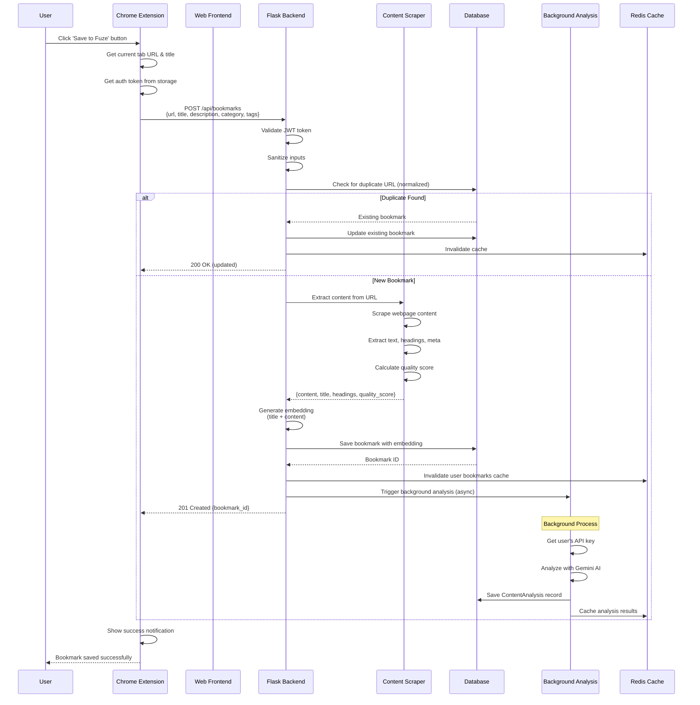
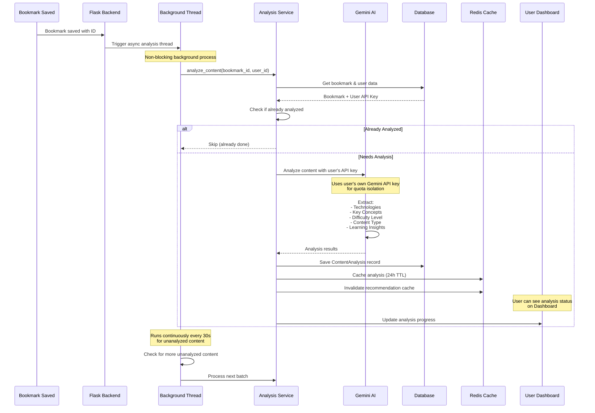
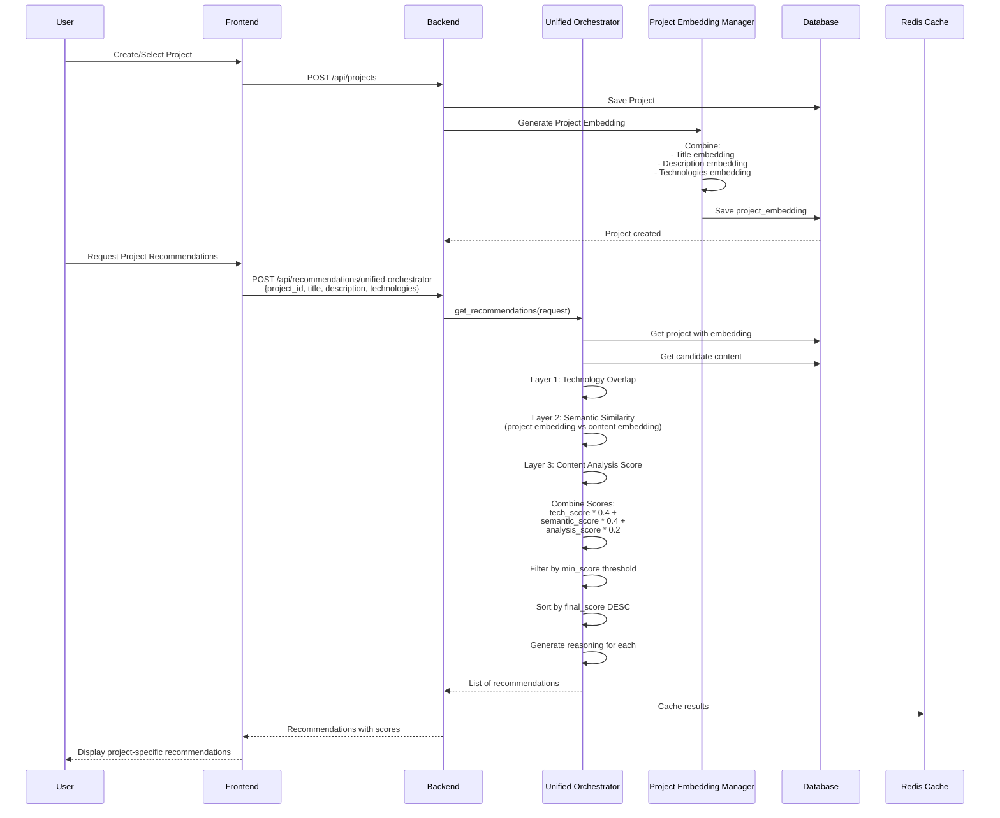
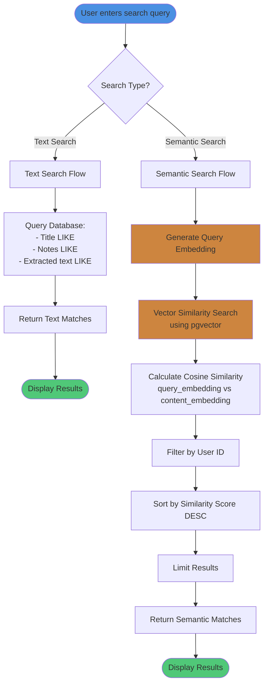
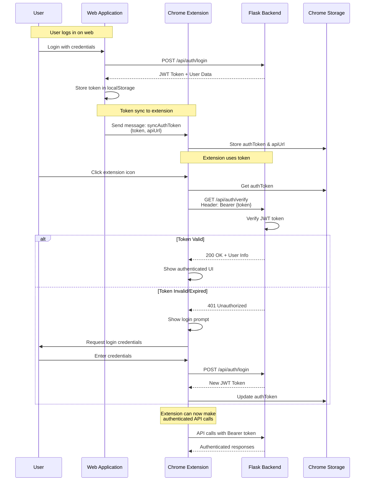
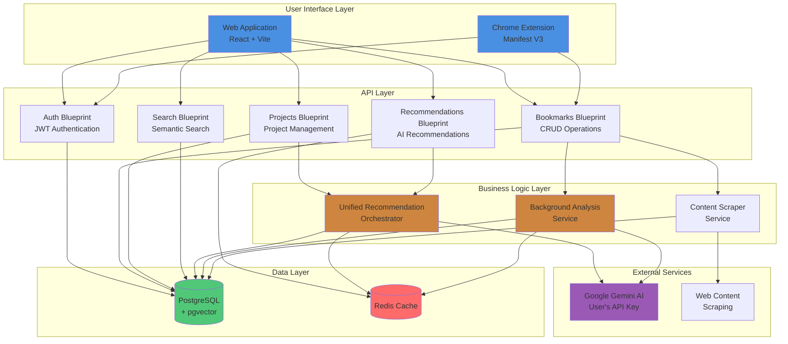

# User Flow Documentation

Complete user journey and system flows for Fuze - Intelligent Bookmark Manager.

## Table of Contents

1. [Complete User Onboarding Flow](#complete-user-onboarding-flow)
2. [Bookmark Saving Flow](#bookmark-saving-flow)
3. [Chrome Extension Import Flow](#chrome-extension-import-flow)
4. [Content Analysis Flow](#content-analysis-flow)
5. [Recommendation Generation Flow](#recommendation-generation-flow)
6. [Project-Based Recommendations Flow](#project-based-recommendations-flow)
7. [Search Flow](#search-flow)
8. [Extension Authentication Flow](#extension-authentication-flow)

---

## Complete User Onboarding Flow

This diagram shows the complete journey from landing page to fully set up account.

```mermaid
flowchart TD
    Start([User visits Landing Page]) --> Landing{User Authenticated?}
    Landing -->|No| ViewLanding[View Landing Page Features]
    Landing -->|Yes| Dashboard[Redirect to Dashboard]
    
    ViewLanding --> ClickSignup[Click 'Start for Free']
    ClickSignup --> LoginPage[Login Page - Signup Mode]
    
    LoginPage --> FillForm[Fill Registration Form]
    FillForm --> ValidateForm{Form Valid?}
    ValidateForm -->|No| ShowErrors[Show Validation Errors]
    ShowErrors --> FillForm
    
    ValidateForm -->|Yes| CheckUsername[Check Username Availability]
    CheckUsername --> UsernameAvailable{Available?}
    UsernameAvailable -->|No| ShowSuggestions[Show Username Suggestions]
    ShowSuggestions --> FillForm
    
    UsernameAvailable -->|Yes| SubmitRegistration[POST /api/auth/register]
    SubmitRegistration --> CreateUser[Create User Account]
    CreateUser --> GenerateToken[Generate JWT Token]
    GenerateToken --> SetOnboarding[Set show_onboarding = true]
    SetOnboarding --> RedirectDashboard[Redirect to Dashboard]
    
    RedirectDashboard --> CheckOnboarding{Onboarding Modal?}
    CheckOnboarding -->|Yes| OnboardingStep1[Step 1: API Key Setup]
    CheckOnboarding -->|No| DashboardView[View Dashboard]
    
    OnboardingStep1 --> HasAPIKey{Has API Key?}
    HasAPIKey -->|No| ShowAPIKeyInstructions[Show Gemini API Key Instructions]
    ShowAPIKeyInstructions --> UserAddsKey[User adds API key in Profile]
    UserAddsKey --> SaveAPIKey[Save API Key to Database]
    SaveAPIKey --> OnboardingStep2
    
    HasAPIKey -->|Yes| OnboardingStep2[Step 2: Install Extension]
    OnboardingStep2 --> ShowExtensionInstructions[Show Extension Installation Guide]
    ShowExtensionInstructions --> UserInstallsExtension[User installs Chrome Extension]
    UserInstallsExtension --> ExtensionLogin[Extension: Login with Credentials]
    ExtensionLogin --> SyncToken[Sync Auth Token to Extension]
    SyncToken --> OnboardingStep3
    
    OnboardingStep3[Step 3: Import Bookmarks] --> ShowImportInstructions[Show Import Instructions]
    ShowImportInstructions --> UserClicksImport[User clicks 'Import All Bookmarks']
    UserClicksImport --> ImportFlow[Start Import Flow]
    ImportFlow --> OnboardingComplete[Mark Onboarding Complete]
    
    OnboardingComplete --> DashboardView
    DashboardView --> End([User Ready to Use Fuze])
    
    style Start fill:#4a90e2
    style End fill:#50c878
    style OnboardingStep1 fill:#cd853f
    style OnboardingStep2 fill:#cd853f
    style OnboardingStep3 fill:#cd853f
```

---

## Bookmark Saving Flow

This shows how bookmarks are saved from the extension or web interface.

---

## Chrome Extension Import Flow

Complete flow for importing all Chrome bookmarks.

```mermaid
flowchart TD
    Start([User clicks 'Import All Bookmarks']) --> CheckAuth{Authenticated?}
    CheckAuth -->|No| ShowLogin[Show Login Prompt]
    ShowLogin --> End1([End])
    
    CheckAuth -->|Yes| GetBookmarks[Extension: getAllBookmarks API]
    GetBookmarks --> FilterBookmarks[Filter & Prepare Bookmarks]
    FilterBookmarks --> CheckServer[Test Server Connection]
    
    CheckServer --> ServerOK{Server OK?}
    ServerOK -->|No| ShowError[Show Connection Error]
    ShowError --> End2([End])
    
    ServerOK -->|Yes| CheckProgress[Check Existing Import Progress]
    CheckProgress --> HasProgress{Import in Progress?}
    HasProgress -->|Yes| ShowProgress[Show Progress Modal]
    ShowProgress --> MonitorProgress[Monitor via SSE Stream]
    MonitorProgress --> WaitComplete{Complete?}
    WaitComplete -->|No| MonitorProgress
    WaitComplete -->|Yes| ShowResults[Show Import Results]
    
    HasProgress -->|No| StartImport[POST /api/bookmarks/import<br/>Array of bookmarks]
    StartImport --> InitProgress[Initialize Progress in Redis]
    InitProgress --> StartSSE[Start SSE Stream for Progress]
    
    StartSSE --> ProcessBatch[Backend: Process Bookmarks in Parallel]
    ProcessBatch --> ForEachBookmark{For Each Bookmark}
    
    ForEachBookmark --> CheckDuplicate[Check if Duplicate]
    CheckDuplicate --> IsDuplicate{Duplicate?}
    IsDuplicate -->|Yes| SkipBookmark[Skip - Increment skipped_count]
    IsDuplicate -->|No| ScrapeContent[Scrape & Extract Content]
    
    ScrapeContent --> QualityCheck{Quality Score >= 5?}
    QualityCheck -->|No| SkipBookmark
    QualityCheck -->|Yes| GenerateEmbedding[Generate Embedding]
    GenerateEmbedding --> AddToBatch[Add to Batch]
    
    SkipBookmark --> UpdateProgress[Update Progress in Redis]
    AddToBatch --> UpdateProgress
    
    UpdateProgress --> MoreBookmarks{More Bookmarks?}
    MoreBookmarks -->|Yes| ForEachBookmark
    MoreBookmarks -->|No| SaveBatch[Save Batch to Database]
    
    SaveBatch --> TriggerAnalysis[Trigger Background Analysis]
    TriggerAnalysis --> MarkComplete[Mark Import Complete]
    MarkComplete --> SendSSE[Send Final Progress via SSE]
    SendSSE --> ShowResults
    
    ShowResults --> DisplayStats[Display Statistics:<br/>- Total<br/>- Added<br/>- Skipped<br/>- Errors]
    DisplayStats --> End3([Import Complete])
    
    style Start fill:#4a90e2
    style End1 fill:#ff6b6b
    style End2 fill:#ff6b6b
    style End3 fill:#50c878
    style ProcessBatch fill:#cd853f
    style ShowResults fill:#50c878
```

---

## Content Analysis Flow

Background analysis of saved bookmarks using Gemini AI.

---

## Recommendation Generation Flow

Complete flow for generating AI-powered recommendations.

```mermaid
flowchart TD
    Start([User requests recommendations]) --> SelectContext[Select Context:<br/>- General Learning<br/>- Project<br/>- Task<br/>- Subtask]
    
    SelectContext --> BuildRequest[Build Recommendation Request]
    BuildRequest --> CheckCache{Check Redis Cache}
    
    CheckCache -->|Hit| ReturnCached[Return Cached Results]
    ReturnCached --> End1([Display Recommendations])
    
    CheckCache -->|Miss| POSTRequest[POST /api/recommendations/unified-orchestrator]
    POSTRequest --> ValidateAuth{Validate JWT}
    ValidateAuth -->|Invalid| Error1[Return 401 Unauthorized]
    
    ValidateAuth -->|Valid| GetOrchestrator[Get Unified Orchestrator Instance]
    GetOrchestrator --> AnalyzeIntent[Analyze User Intent]
    
    AnalyzeIntent --> IntentEngine{Intent Analysis Engine}
    IntentEngine -->|Success| GetIntent[Get Intent:<br/>- Goal: learn/build/explore<br/>- Technologies<br/>- Difficulty]
    IntentEngine -->|Failed| FallbackIntent[Use Fallback Intent]
    
    GetIntent --> EnhanceRequest[Enhance Request with Intent]
    FallbackIntent --> EnhanceRequest
    
    EnhanceRequest --> GetCandidates[Get Candidate Content from DB]
    GetCandidates --> FilterCandidates[Filter by:<br/>- Quality Score >= 7<br/>- Has embeddings<br/>- User's content + Global]
    
    FilterCandidates --> SelectEngine[Select Engine Strategy]
    SelectEngine --> EngineChoice{Engine Selection}
    
    EngineChoice -->|Fast Path| FastSemantic[Fast Semantic Engine]
    EngineChoice -->|Context Path| ContextAware[Context-Aware Engine]
    EngineChoice -->|ML Path| MLEngine[ML-Enhanced Engine]
    
    FastSemantic --> CalculateScores[Calculate Similarity Scores]
    ContextAware --> CalculateScores
    MLEngine --> CalculateScores
    
    CalculateScores --> ApplyFilters[Apply Filters:<br/>- Quality threshold<br/>- Relevance threshold<br/>- Confidence threshold]
    
    ApplyFilters --> DiversityFilter{Diversity Enabled?}
    DiversityFilter -->|Yes| ApplyDiversity[Apply Diversity Filtering]
    DiversityFilter -->|No| SortResults
    
    ApplyDiversity --> SortResults[Sort by Combined Score]
    SortResults --> LimitResults[Limit to max_recommendations]
    
    LimitResults --> GenerateSummaries[Generate Context Summaries]
    GenerateSummaries --> GeminiSummaries[Use Gemini for summaries<br/>if available]
    GeminiSummaries --> FormatResults[Format Results]
    
    FormatResults --> CacheResults[Cache Results in Redis]
    CacheResults --> ReturnResults[Return Recommendations]
    ReturnResults --> End2([Display Recommendations])
    
    Error1 --> End3([Show Error])
    
    style Start fill:#4a90e2
    style End1 fill:#50c878
    style End2 fill:#50c878
    style End3 fill:#ff6b6b
    style AnalyzeIntent fill:#cd853f
    style SelectEngine fill:#cd853f
    style GenerateSummaries fill:#cd853f
```

---

## Project-Based Recommendations Flow

Recommendations specific to a project context.

---

## Search Flow

Semantic and text-based search functionality.

---

## Extension Authentication Flow

How the Chrome extension authenticates and syncs with the web platform.

---

## Complete System Architecture Flow

High-level view of how all components interact.

---

## Key User Journeys Summary

### Journey 1: New User Onboarding
1. Visit landing page → Sign up → Set API key → Install extension → Import bookmarks → Start using

### Journey 2: Saving a Bookmark
1. Browse web → Click extension → Save bookmark → Content extracted → Background analysis → Ready for recommendations

### Journey 3: Getting Recommendations
1. Go to Recommendations page → Select context → Request recommendations → View personalized results → Save useful ones

### Journey 4: Project-Based Learning
1. Create project → Add tasks → Get project recommendations → Save relevant content → Track progress

### Journey 5: Content Discovery
1. Use semantic search → Find related content → View recommendations → Discover new resources

---

## Notes

- **Background Processing**: Content analysis runs asynchronously to avoid blocking user requests
- **Caching Strategy**: Multiple layers of caching (Redis, query cache, recommendation cache) for performance
- **User Isolation**: Each user's API key is used for their own Gemini requests, ensuring quota isolation
- **Error Handling**: Graceful fallbacks at every step to ensure system reliability
- **Real-time Updates**: SSE streams for import progress, WebSocket-ready architecture

---

*Last Updated: 2024*

