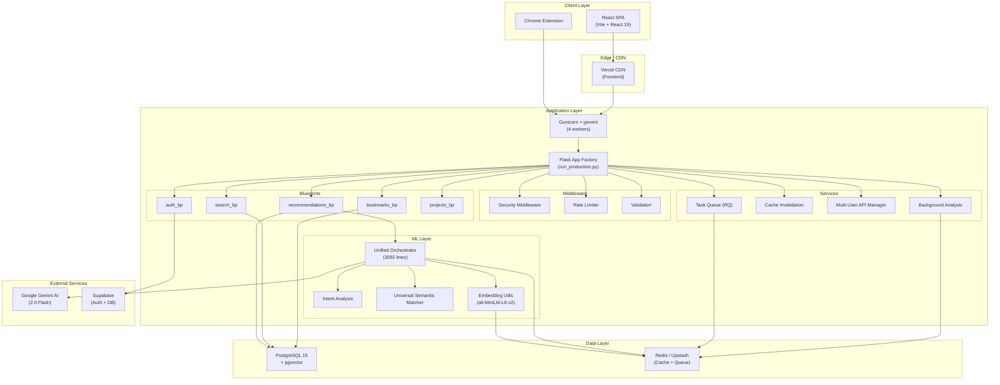
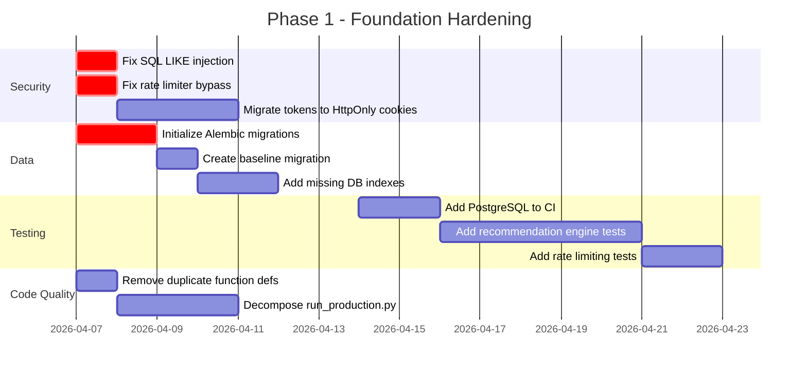
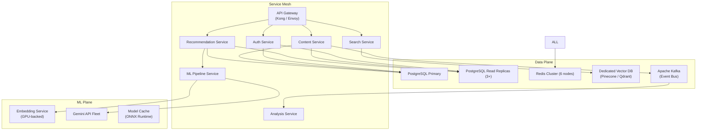

# Fuze — Production-Grade Architectural Audit

> **Auditor:** Senior Principal Engineer / System Architect
> **Date:** 2026-04-05
> **Scope:** Full-stack codebase (backend, frontend, Chrome extension, infrastructure)
> **Verdict:** Solid MVP with strong foundations — requires targeted hardening for production scale.

---

## Table of Contents

1. [Executive Summary](#1-executive-summary)
2. [System Architecture Overview](#2-system-architecture-overview)
3. [Data Layer Deep Dive](#3-data-layer-deep-dive)
4. [ML & Recommendation Pipeline](#4-ml--recommendation-pipeline)
5. [API Contract Inventory](#5-api-contract-inventory)
6. [Security Posture](#6-security-posture)
7. [Frontend Architecture](#7-frontend-architecture)
8. [Infrastructure & Deployment](#8-infrastructure--deployment)
9. [Testing & Quality Assurance](#9-testing--quality-assurance)
10. [Observability & Operational Readiness](#10-observability--operational-readiness)
11. [Prioritized Fix List (Severity Matrix)](#11-prioritized-fix-list)
12. [Billion-User Upgrade Roadmap](#12-billion-user-upgrade-roadmap)

---

## 1. Executive Summary

**Fuze** is an AI-powered bookmark and knowledge management platform that helps developers organize saved content, generate embeddings for semantic search, and receive intelligent project-specific recommendations via a multi-engine ML pipeline backed by Gemini AI.

### What It Does Well
- ✅ **Sophisticated ML pipeline** — Unified Orchestrator with intent analysis, semantic matching, and multi-engine fallback
- ✅ **Per-user API key management** — Encrypted storage with Fernet, rate limiting, and revocation support
- ✅ **Production-aware configuration** — `UnifiedConfig` centralizes 40+ env vars with validation and defaults
- ✅ **Lazy model loading** — Embedding model deferred to first use, preventing OOM at startup
- ✅ **Comprehensive cache invalidation** — Event-driven hooks for content, project, task, and user lifecycle
- ✅ **Test safety** — Triple-check production-DB guard in `conftest.py` prevents accidental data wipes
- ✅ **Frontend code splitting** — Route-level lazy loading and vendor chunking via Vite

### Critical Gaps
- 🔴 **No database migration tool in use** — Alembic is in `requirements.txt` but schema changes are done via ad-hoc scripts
- 🔴 **SQL injection vector** in text search — raw `f'%{query}%'` in `ilike()` filters
- 🔴 **God object** — `unified_recommendation_orchestrator.py` is **3,092 lines / 154KB**
- 🔴 **Rate limiter bypass** — inline lambda definition inside route handler doesn't actually apply limits
- 🟡 **No distributed locking** — Background analysis service uses threading without Redis-based locks
- 🟡 **Duplicate function definitions** — `get_project_embedding()` defined twice in `embedding_utils.py`

---

## 2. System Architecture Overview



### Architecture Pattern: **Modular Monolith**

| Aspect | Current State | Scale Concern |
|--------|--------------|---------------|
| **Deployment** | Single Gunicorn process + RQ worker | ⚠️ Vertical scaling only |
| **Database** | Single PostgreSQL instance | ⚠️ No read replicas or sharding |
| **Caching** | Redis (single instance) + in-memory | ⚠️ No cache cluster |
| **Background Processing** | RQ (single worker) | ⚠️ No distributed task processing |
| **ML Inference** | In-process SentenceTransformer | 🔴 Blocks request threads |
| **Frontend** | Vercel-deployed SPA | ✅ CDN-ready, globally distributed |

---

## 3. Data Layer Deep Dive

### 3.1 Schema Analysis — [models.py](file:///c:/Users/ujjwa/OneDrive/Desktop/fuze/backend/models.py)

| Model | Purpose | Key Fields | Indexes | Concern |
|-------|---------|------------|---------|---------|
| `User` | Authentication & profile | `email`, `password_hash`, `user_metadata` (JSON) | ✅ Unique on `email`, `username` | API keys stored in JSON blob |
| `SavedContent` | Bookmarks with embeddings | `embedding` (Vector 384d), `quality_score`, `extracted_text` | ✅ Composite `(user_id, url)` | `extracted_text` unbounded |
| `Project` | User projects | `title`, `technologies`, `intent_analysis` | ✅ `user_id` indexed | `intent_analysis` JSON unconstrained |
| `Task` | Project tasks | `title`, `project_id`, `completed` | ✅ FKs with cascade | No audit trail |
| `Subtask` | Task subtasks | `title`, `task_id`, `embedding` | ✅ FKs with cascade | Embedding on subtasks = storage cost |
| `ContentAnalysis` | AI analysis results | `analysis_data` (JSON), `key_concepts` | ⚠️ No index on `content_id` alone | Unbounded JSON |
| `UserFeedback` | Recommendation feedback | `recommendation_id`, `feedback_type` | ⚠️ No compound index | Missing `created_at` default |

> [!WARNING]
> **No Alembic migrations in active use.** Schema changes rely on `database_indexes.py` and `database_security_migration.py` helper scripts. This means:
> - No version history of schema changes
> - No rollback capability
> - Risk of schema drift between environments

### 3.2 Database Connection Management — [database_utils.py](file:///c:/Users/ujjwa/OneDrive/Desktop/fuze/backend/utils/database_utils.py)

**Strengths:**
- Retry logic with exponential backoff (3 attempts)
- SSL certificate handling for cloud providers
- Connection pool configuration (`pool_size=5`, `max_overflow=10`)

**Weaknesses:**
- `pool_pre_ping=True` adds latency to every connection checkout
- No connection pool monitoring or alerting
- No read/write splitting capability

### 3.3 Redis Layer — [redis_utils.py](file:///c:/Users/ujjwa/OneDrive/Desktop/fuze/backend/utils/redis_utils.py)

611 lines covering: embedding cache, scraping cache, bookmark cache, query cache, analysis cache, and recommendation cache.

**Key Cache TTLs:**

| Cache Type | TTL | Notes |
|-----------|-----|-------|
| Embeddings | 24h | Appropriate for stable content |
| Scraping results | 7d | Could be shorter for dynamic pages |
| User bookmarks | 5min | Prevents stale reads |
| Recommendations | 30min | Good balance of freshness |
| Content analysis | 24h | Appropriate post-analysis |

> [!IMPORTANT]
> **Cache key patterns use wildcards (`*`) for invalidation** — `delete_keys_pattern("*embedding:*")` in [cache_invalidation_service.py](file:///c:/Users/ujjwa/OneDrive/Desktop/fuze/backend/services/cache_invalidation_service.py#L130). At scale, `KEYS *` commands block Redis. Should migrate to `SCAN` or tag-based invalidation.

---

## 4. ML & Recommendation Pipeline

### 4.1 Orchestrator — [unified_recommendation_orchestrator.py](file:///c:/Users/ujjwa/OneDrive/Desktop/fuze/backend/ml/unified_recommendation_orchestrator.py)

> [!CAUTION]
> **This file is 3,092 lines / 154KB.** It contains the entire recommendation pipeline: data layer, 3 engine implementations, scoring, re-ranking, caching, context generation, and performance monitoring. This is the single biggest technical debt item in the codebase.

**Pipeline Flow:**
```
Request → Cache Check → Content Fetch → Intent Analysis → 
Multi-Engine Scoring (Semantic + Context + Keyword) → 
ML Enhancement → Dedup → Re-rank → Format → Cache → Response
```

**Engine Hierarchy:**

| Engine | Purpose | Strengths | Concerns |
|--------|---------|-----------|---------|
| `FastSemanticEngine` | Primary — embedding similarity | Fast batch processing | Falls back to word overlap without model |
| `ContextEngine` | Context-aware matching | Gemini-powered analysis | API rate limits |
| `KeywordEngine` (implicit) | Technology matching | No ML dependency | Simplistic scoring |
| `UniversalSemanticMatcher` | Cross-domain matching | Handles diverse content | 14KB additional module |

### 4.2 Embedding Model — [embedding_utils.py](file:///c:/Users/ujjwa/OneDrive/Desktop/fuze/backend/utils/embedding_utils.py)

```
Model: all-MiniLM-L6-v2 (384 dimensions, ~90MB)
Loading: Lazy singleton with threading lock (double-check pattern)
Fallback: Hash-based TF-IDF approximation (graceful degradation)
```

> [!NOTE]
> **Duplicate function definition:** `get_project_embedding()` is defined twice (lines 299 and 371). The second definition silently overwrites the first. They are functionally identical but the duplication signals copy-paste development.

### 4.3 Gemini Integration — [gemini_utils.py](file:///c:/Users/ujjwa/OneDrive/Desktop/fuze/backend/utils/gemini_utils.py)

- **1,303 lines** covering: content analysis, context analysis, reasoning, ranking, batch processing, and fallback logic
- **Model cascade:** `gemini-2.0-flash` → `gemini-1.5-pro` → `gemini-pro`
- **Retry:** 3 attempts with linear backoff
- **JSON extraction:** Multi-pattern regex parser for structured responses
- **Per-user caching:** Gemini analyzer instances cached per user_id with 5-minute TTL

### 4.4 Background Analysis — [background_analysis_service.py](file:///c:/Users/ujjwa/OneDrive/Desktop/fuze/backend/services/background_analysis_service.py)

```
Worker Loop: Check every 30s → Fetch 10 unanalyzed items → 
Group by user → Rate-limit check → Analyze via Gemini → 
Store result → Invalidate caches → Sleep 3s between items
```

> [!WARNING]
> **Thread-based background worker without distributed locking.** If multiple Gunicorn workers are running, each spins up its own `BackgroundAnalysisService` thread, causing:
> - Duplicate analysis of the same content
> - Wasted API quota (per-user rate limits checked in-process only)
> - Race conditions on `ContentAnalysis` creation (mitigated by duplicate check, but not atomic)

---

## 5. API Contract Inventory

### Backend Routes (Blueprints)

| Blueprint | Prefix | Key Endpoints | Auth | Rate Limit |
|-----------|--------|---------------|------|------------|
| `auth_bp` | `/api/auth` | `POST /register`, `POST /login`, `POST /logout`, `POST /supabase-oauth` | Mixed | ✅ Per-endpoint |
| `bookmarks_bp` | `/api/bookmarks` | `GET /`, `POST /`, `PUT /:id`, `DELETE /:id`, `POST /analyze` | JWT | ✅ |
| `search_bp` | `/api/search` | `POST /semantic`, `GET /text`, `POST /supabase-semantic` | JWT | ⚠️ No limit |
| `recommendations_bp` | `/api/recommendations` | `POST /unified-orchestrator`, `POST /generate-context`, `POST /task/:id`, `POST /subtask/:id` | JWT | ⚠️ Broken |
| `projects_bp` | `/api/projects` | CRUD + tasks + subtasks | JWT | ⚠️ No limit |
| `profile_bp` | `/api/profile` | `GET /`, `PUT /` | JWT | ✅ |

> [!CAUTION]
> **Rate limiting is broken on the primary recommendation endpoint.**
> In [recommendations.py:167-172](file:///c:/Users/ujjwa/OneDrive/Desktop/fuze/backend/blueprints/recommendations.py#L167-L172):
> ```python
> @current_app.limiter.limit("20 per minute", key_func=lambda: get_jwt_identity())
> def _rate_limited():
>     pass
> _rate_limited()
> ```
> This creates and immediately invokes an inner function — the decorator only applies to `_rate_limited()`, not to the actual route handler. The rate limit has **zero effect**.

### Frontend API Service — [api.js](file:///c:/Users/ujjwa/OneDrive/Desktop/fuze/frontend/src/services/api.js)

- **Axios-based** with interceptors for auth token injection
- **CSRF token management** — fetched on init and included in mutation requests
- **Auto-logout on 401** via response interceptor (`authExpired` event)
- **Error classification** — `handleApiError()` with user-friendly messages
- **Request deduplication** — `AbortController` for concurrent identical requests

---

## 6. Security Posture

### 6.1 Authentication

| Control | Implementation | Rating |
|---------|---------------|--------|
| Password hashing | `werkzeug.security.generate_password_hash` | ✅ Industry standard |
| JWT tokens | Flask-JWT-Extended, access + refresh tokens | ✅ |
| OAuth | Supabase OAuth integration | ✅ |
| CSRF protection | Custom token-based CSRF | ⚠️ Token rotation lacking |
| Session management | JWT in localStorage + HttpOnly cookies | ⚠️ localStorage XSS risk |

### 6.2 Data Protection

| Control | Implementation | Rating |
|---------|---------------|--------|
| API key encryption | Fernet symmetric encryption | ✅ |
| API key revocation | Dedicated revocation manager | ✅ |
| User isolation (RLS) | Middleware-enforced `user_id` filtering | ⚠️ Not DB-level RLS |
| Input validation | Schema-based JSON validation | ⚠️ Not on all endpoints |
| SQL injection | ⚠️ **VULNERABLE** in text search | 🔴 |

> [!CAUTION]
> **SQL Injection Risk** in [search.py:98-101](file:///c:/Users/ujjwa/OneDrive/Desktop/fuze/backend/blueprints/search.py#L96-L102):
> ```python
> SavedContent.title.ilike(f'%{query}%'),
> SavedContent.notes.ilike(f'%{query}%'),
> SavedContent.extracted_text.ilike(f'%{query}%')
> ```
> While SQLAlchemy parameterizes the query, the `%` wildcards around user input allow **LIKE injection** (e.g., `query = "%"` returns all rows). More importantly, a malicious `query` containing `%` or `_` characters can cause performance degradation via pattern expansion. **Fix:** Escape special SQL LIKE characters before interpolation.

### 6.3 Security Headers — [security_middleware.py](file:///c:/Users/ujjwa/OneDrive/Desktop/fuze/backend/middleware/security_middleware.py)

Applied headers: `X-Content-Type-Options`, `X-Frame-Options`, `X-XSS-Protection`, `Strict-Transport-Security`, `Content-Security-Policy`, `Referrer-Policy`.

**Missing:** `Permissions-Policy` header.

### 6.4 CORS Policy

```python
# From run_production.py
CORS(app, origins=["https://fuze-ai.vercel.app", "http://localhost:*"],
     supports_credentials=True)
```
✅ Properly restricted to known origins.

---

## 7. Frontend Architecture

### 7.1 Stack & Dependencies — [package.json](file:///c:/Users/ujjwa/OneDrive/Desktop/fuze/frontend/package.json)

| Dependency | Version | Notes |
|-----------|---------|-------|
| React | 19.1.0 | ✅ Latest stable |
| React Router | 6.30.1 | ✅ Latest |
| Axios | 1.10.0 | ✅ |
| Lucide React | 0.525.0 | ✅ Tree-shakeable icons |
| Vite | 4.5.14 | ⚠️ Vite 4 is behind — Vite 6 is current |
| Vitest | 2.1.8 | ✅ |

**Dev dependencies include Tailwind v4 (`@tailwindcss/postcss: ^4.1.11`)** — but the codebase uses vanilla CSS. This adds ~3MB of unused dev dependency.

### 7.2 App Component — [App.jsx](file:///c:/Users/ujjwa/OneDrive/Desktop/fuze/frontend/src/App.jsx)

- **Route-level code splitting** via `React.lazy()` for all protected routes
- **Global OAuth handler** processes tokens from hash/query params on any route
- **Onboarding flow** driven by `localStorage` flags and custom events
- **Responsive sidebar** with collapse state managed via `document.body.classList`

> [!NOTE]
> **DOM manipulation anti-pattern:** Lines 172-204 directly manipulate `document.body.classList` and force reflows via `document.body.offsetHeight`. This should use React state/context or CSS custom properties instead.

### 7.3 Auth Context — [AuthContext.jsx](file:///c:/Users/ujjwa/OneDrive/Desktop/fuze/frontend/src/contexts/AuthContext.jsx)

- **localStorage hydration** on mount (SSR-unsafe but acceptable for SPA)
- **useRef for closure safety** — `userRef` avoids stale closures in async operations
- **Token lifecycle:** Login → store token + user → set Axios header → fetch profile
- **Logout cleanup:** Clears state, localStorage, Axios headers, and calls server logout

**Issue:** `logout()` calls `api.post('/api/auth/logout').catch(console.error)` — fire-and-forget server request. If the server is down, cookies won't be cleared server-side.

### 7.4 Build Optimization — [vite.config.js](file:///c:/Users/ujjwa/OneDrive/Desktop/fuze/frontend/vite.config.js)

```
Manual chunks: react-vendor, router-vendor, axios-vendor, icons-vendor,
               dashboard, project-detail, recommendations
Tree shaking: Enabled (moduleSideEffects: false)
Service Worker: Build hash injection via custom plugin
```

✅ Well-optimized vendor splitting strategy. CSS code-splitting enabled.

⚠️ `treeshake.moduleSideEffects: false` is aggressive — may break libraries that rely on side-effect imports (e.g., CSS-in-JS polyfills). Monitor for breakage.

---

## 8. Infrastructure & Deployment

### 8.1 Docker — [Dockerfile](file:///c:/Users/ujjwa/OneDrive/Desktop/fuze/Dockerfile)

- **Base:** `python:3.11-slim`
- **Multi-stage:** No ❌ (single stage, could reduce image size by ~40%)
- **System deps:** `gcc`, `libpq-dev`, `curl` (for healthchecks)
- **Entrypoint:** `start.sh` (manages worker + Gunicorn)

### 8.2 Production Server — [start.sh](file:///c:/Users/ujjwa/OneDrive/Desktop/fuze/start.sh)

```bash
# Starts RQ worker in background
python backend/worker.py &

# Starts Gunicorn
gunicorn backend.wsgi:app --workers 4 --worker-class gevent \
  --bind 0.0.0.0:$PORT --timeout 120
```

> [!WARNING]
> **Worker lifecycle management:** The RQ worker runs as a background process (`&`) without supervision. If it crashes, it stays dead until the container restarts. Should use a process manager (`supervisord`) or separate container.

### 8.3 Keepalive Infrastructure

| Script | Purpose | Schedule |
|--------|---------|----------|
| [ping_db.py](file:///c:/Users/ujjwa/OneDrive/Desktop/fuze/scripts/ping_db.py) | Prevent Supabase pausing | GitHub Actions cron |
| [ping_redis.py](file:///c:/Users/ujjwa/OneDrive/Desktop/fuze/scripts/ping_redis.py) | Prevent Upstash pausing | GitHub Actions cron |

✅ Smart workaround for free-tier limitations. Both scripts have proper error handling and TLS auto-detection.

### 8.4 CI/CD — [backend-ci.yml](file:///c:/Users/ujjwa/OneDrive/Desktop/fuze/.github/workflows/backend-ci.yml)

- **Trigger:** Push/PR to `main`/`develop` on backend changes
- **Services:** Redis 7 Alpine (for integration tests)
- **Coverage:** pytest + Codecov integration
- **Test DB:** SQLite in-memory (fast but doesn't test pgvector)

> [!IMPORTANT]
> **CI tests run against SQLite, but production uses PostgreSQL + pgvector.** This means:
> - Vector similarity queries are never tested in CI
> - PostgreSQL-specific SQL features untested
> - Index behavior differences undetected
> 
> **Recommendation:** Add a PostgreSQL service container to CI for integration tests.

### 8.5 Frontend Deployment — [vercel.json](file:///c:/Users/ujjwa/OneDrive/Desktop/fuze/frontend/vercel.json)

- **SPA rewrite:** All routes → `index.html`
- **Immutable caching:** 1-year cache for hashed assets (JS, CSS, SVG, images, fonts)
- **JSON:** `max-age=0, must-revalidate` (correct for dynamic manifests)
- **API CORS:** Wildcard `*` origin ⚠️ — should match backend's restricted CORS policy

> [!WARNING]
> `vercel.json` sets `Access-Control-Allow-Origin: *` for `/api/*` routes. While the frontend doesn't proxy API calls through Vercel (they go directly to the backend), this header on Vercel's side could be exploited if API routes are ever added to the Vercel deployment.

---

## 9. Testing & Quality Assurance

### 9.1 Test Infrastructure — [conftest.py](file:///c:/Users/ujjwa/OneDrive/Desktop/fuze/backend/tests/conftest.py)

**Outstanding safety measures:**
- Triple production-DB guard (environment check → config check → teardown check)
- Forces SQLite for any non-test database URL
- Explicit warning banners for attempted production DB connections
- Mock fixtures for Redis, embedding model, and Gemini API

### 9.2 Test Coverage Gaps

| Area | Coverage | Risk |
|------|----------|------|
| Auth flows (login, register, OAuth) | ✅ Good | Low |
| Bookmark CRUD | ✅ Good | Low |
| Recommendation engine scoring | ⚠️ Limited | **High** — core business logic |
| Background analysis pipeline | ⚠️ Limited | **High** — data quality depends on it |
| Cache invalidation cascades | ❌ Missing | **Medium** — stale data risk |
| Embedding model fallback paths | ❌ Missing | **Medium** — degraded recommendations |
| Rate limiting behavior | ❌ Missing | **High** — abuse risk |
| WebSocket/real-time features | N/A | N/A |

### 9.3 Frontend Testing

- **Framework:** Vitest + React Testing Library + MSW (for API mocking)
- **Coverage tool:** `@vitest/coverage-v8`
- **Gap:** No E2E tests (Playwright directory exists in `.gitignore` but no tests found)

---

## 10. Observability & Operational Readiness

### 10.1 Logging

- **Backend:** Python `logging` with UTC timestamps, structured format
- **Frontend:** `console.error`/`console.warn` (production debug logs removed ✅)
- **Missing:** Correlation IDs across request lifecycle, structured JSON logging for log aggregation

### 10.2 Health Checks

From [run_production.py](file:///c:/Users/ujjwa/OneDrive/Desktop/fuze/backend/run_production.py):

| Endpoint | Checks | Response |
|----------|--------|----------|
| `/health` | App alive | `200 OK` |
| `/health/detailed` | DB + Redis + ML model | JSON with component status |

✅ Well-implemented with timeout handling and graceful degradation.

### 10.3 Metrics & Alerting

- ❌ No Prometheus/StatsD metrics export
- ❌ No APM integration (DataDog, New Relic, Sentry)
- ❌ No error rate tracking or anomaly detection
- ⚠️ Performance metrics tracked in-memory only (`EnginePerformance` dataclass)

---

## 11. Prioritized Fix List

### Severity Legend
- 🔴 **CRITICAL** — Security vulnerability or data loss risk. Fix immediately.
- 🟠 **HIGH** — Performance or reliability issue. Fix within 1 sprint.
- 🟡 **MEDIUM** — Code quality or maintainability concern. Fix within 1 month.
- 🟢 **LOW** — Enhancement or optimization. Address opportunistically.

| # | Severity | Category | Issue | File | Fix |
|---|----------|----------|-------|------|-----|
| 1 | 🔴 | **Security** | SQL LIKE injection in text search | [search.py:98-101](file:///c:/Users/ujjwa/OneDrive/Desktop/fuze/backend/blueprints/search.py#L96-L102) | Escape `%` and `_` chars in user input |
| 2 | 🔴 | **Security** | Rate limiter bypass on recommendations | [recommendations.py:167-172](file:///c:/Users/ujjwa/OneDrive/Desktop/fuze/backend/blueprints/recommendations.py#L167-L172) | Apply `@limiter.limit` directly on route |
| 3 | 🔴 | **Data** | No Alembic migrations active | `backend/` | Initialize Alembic, create baseline migration |
| 4 | 🟠 | **Reliability** | Background worker lacks distributed locking | [background_analysis_service.py:80](file:///c:/Users/ujjwa/OneDrive/Desktop/fuze/backend/services/background_analysis_service.py#L80) | Use Redis `SETNX`-based distributed lock |
| 5 | 🟠 | **Performance** | `KEYS *` pattern in cache invalidation | [cache_invalidation_service.py:120-133](file:///c:/Users/ujjwa/OneDrive/Desktop/fuze/backend/services/cache_invalidation_service.py#L120-L133) | Migrate to `SCAN` or prefix-based tag sets |
| 6 | 🟠 | **Architecture** | God object: orchestrator at 3092 lines | [unified_recommendation_orchestrator.py](file:///c:/Users/ujjwa/OneDrive/Desktop/fuze/backend/ml/unified_recommendation_orchestrator.py) | Decompose into `data_layer.py`, `engines/`, `scorer.py`, `orchestrator.py` |
| 7 | 🟠 | **Reliability** | RQ worker unsupervised in start.sh | [start.sh](file:///c:/Users/ujjwa/OneDrive/Desktop/fuze/start.sh) | Use `supervisord` or separate container |
| 8 | 🟡 | **Code Quality** | Duplicate `get_project_embedding()` definition | [embedding_utils.py:299,371](file:///c:/Users/ujjwa/OneDrive/Desktop/fuze/backend/utils/embedding_utils.py#L299) | Remove second definition |
| 9 | 🟡 | **Testing** | CI tests on SQLite, prod on PostgreSQL+pgvector | [backend-ci.yml:56](file:///c:/Users/ujjwa/OneDrive/Desktop/fuze/.github/workflows/backend-ci.yml#L56) | Add PostgreSQL service container |
| 10 | 🟡 | **Frontend** | DOM manipulation for sidebar state | [App.jsx:172-204](file:///c:/Users/ujjwa/OneDrive/Desktop/fuze/frontend/src/App.jsx#L172-L204) | Use CSS custom properties via React state |
| 11 | 🟡 | **Security** | JWT tokens in localStorage (XSS-accessible) | [AuthContext.jsx:68,122](file:///c:/Users/ujjwa/OneDrive/Desktop/fuze/frontend/src/contexts/AuthContext.jsx#L68) | Migrate to HttpOnly cookie-only auth |
| 12 | 🟡 | **Infra** | Vercel CORS set to wildcard for `/api/*` | [vercel.json:18](file:///c:/Users/ujjwa/OneDrive/Desktop/fuze/frontend/vercel.json#L18) | Restrict to known backend origins or remove |
| 13 | 🟡 | **Performance** | `run_production.py` is 1000+ lines | [run_production.py](file:///c:/Users/ujjwa/OneDrive/Desktop/fuze/backend/run_production.py) | Extract middleware, error handlers, health checks into modules |
| 14 | 🟢 | **Dependencies** | Unused Tailwind dev dependency | [package.json:27](file:///c:/Users/ujjwa/OneDrive/Desktop/fuze/frontend/package.json#L27) | Remove if not using Tailwind |
| 15 | 🟢 | **Dependencies** | Vite 4 is behind (Vite 6 available) | [package.json:46](file:///c:/Users/ujjwa/OneDrive/Desktop/fuze/frontend/package.json#L46) | Upgrade Vite for build performance gains |
| 16 | 🟢 | **Observability** | No structured logging or APM | Backend-wide | Add `structlog` + Sentry/DataDog integration |
| 17 | 🟢 | **Performance** | Supabase semantic search fetches ALL embeddings into Python | [search.py:146-148](file:///c:/Users/ujjwa/OneDrive/Desktop/fuze/backend/blueprints/search.py#L146-L148) | Use Supabase RPC for server-side vector similarity |

---

## 12. Billion-User Upgrade Roadmap

### Phase 1: Foundation Hardening (Weeks 1-4) — DAU Target: 10K

> **Theme:** Fix critical vulnerabilities, establish data governance, and harden testing.



**Deliverables:**
- [ ] All 🔴 CRITICAL issues resolved
- [ ] Alembic migration pipeline with CI integration
- [ ] PostgreSQL service container in CI
- [ ] ≥70% test coverage on recommendation scoring logic

---

### Phase 2: Scale Architecture (Weeks 5-12) — DAU Target: 100K

> **Theme:** Decompose monolith, introduce horizontal scaling, add observability.

**Key Changes:**

| Component | Current | Target |
|-----------|---------|--------|
| ML Orchestrator | 3092-line monolith | 4-5 focused modules (≤500 lines each) |
| Background Worker | `threading.Thread` | Dedicated RQ container with Redis locks |
| Cache Invalidation | `KEYS *` pattern | `SCAN` + prefix tags + pub/sub notifications |
| Logging | Python `logging` | `structlog` + JSON + correlation IDs |
| Monitoring | Health endpoints only | Prometheus metrics + Grafana dashboards |
| Error Tracking | `console.error` | Sentry integration (frontend + backend) |
| Database | Single instance | Primary + 1 read replica |

**Orchestrator Decomposition Plan:**

```
backend/ml/
├── orchestrator.py              # ~300 lines — coordination & caching
├── data_layer.py                # ~400 lines — DB queries & normalization
├── engines/
│   ├── fast_semantic_engine.py  # ~300 lines
│   ├── context_engine.py        # ~400 lines
│   └── keyword_engine.py        # ~200 lines
├── scoring/
│   ├── relevance_scorer.py      # ~200 lines
│   └── diversity_scorer.py      # ~100 lines
├── intent_analysis_engine.py    # Existing, keep as-is
└── types.py                     # Dataclasses & enums
```

---

### Phase 3: Performance Engineering (Weeks 13-24) — DAU Target: 1M

> **Theme:** Optimize hot paths, introduce caching layers, pre-compute embeddings.

**Key Changes:**

| Optimization | Impact | Effort |
|-------------|--------|--------|
| Pre-compute & store content embeddings in DB | Eliminates real-time model inference | Medium |
| Move embedding model to dedicated microservice | Unblocks request threads | High |
| Implement Redis Cluster | Removes single-point-of-failure for cache | Medium |
| Add CDN caching for static API responses | Reduces backend load by ~40% | Low |
| Implement connection pooling with PgBouncer | Supports 10x more concurrent DB connections | Medium |
| Add GraphQL gateway for frontend queries | Reduces over-fetching, enables batching | High |
| Implement WebSocket for real-time analysis status | Replaces polling-based progress tracking | Medium |

---

### Phase 4: Hyperscale (Months 7-18) — DAU Target: 10M → 1B

> **Theme:** Service decomposition, geo-distribution, and ML pipeline independence.



**Phase 4 Architectural Decisions:**

| Decision | Rationale |
|----------|-----------|
| **Dedicated Vector DB** (Pinecone/Qdrant) | pgvector works at current scale but tops out at ~10M vectors with acceptable latency |
| **Event-driven analysis** via Kafka | Decouples content ingestion from analysis, enables replay and multi-consumer patterns |
| **ONNX Runtime for embeddings** | 3-5x faster inference vs PyTorch on CPU, enables quantized models |
| **Multi-region deployment** | Required for <100ms P95 latency globally |
| **Database sharding** (by user_id) | Beyond 100M users, single-node PostgreSQL read replicas won't suffice |

---

## Summary of Effort Estimates

| Phase | Timeline | Team Size | DAU Target | Key Outcome |
|-------|----------|-----------|------------|-------------|
| **Phase 1** | 4 weeks | 1-2 engineers | 10K | Security hardened, data governance established |
| **Phase 2** | 8 weeks | 2-3 engineers | 100K | Horizontally scalable, observable, well-tested |
| **Phase 3** | 12 weeks | 3-4 engineers | 1M | Performance-optimized, real-time capable |
| **Phase 4** | 12+ months | 5-8 engineers | 10M-1B | Microservices, geo-distributed, ML-independent |

---

> **Final Verdict:** Fuze is an impressively ambitious project with a well-thought-out ML pipeline and solid production-awareness (lazy loading, graceful degradation, multi-level caching). The codebase shows signs of rapid iteration (god objects, duplicate code, broken rate limiting) that are normal at this stage. The Phase 1 fixes are all quick wins that dramatically improve the security and reliability posture. The architecture is fundamentally sound for the current scale and has clear, non-disruptive upgrade paths to 1B users.
